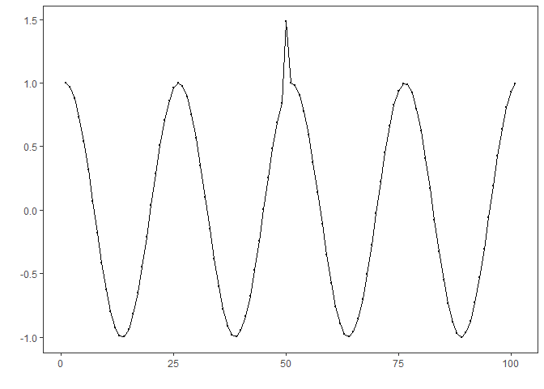
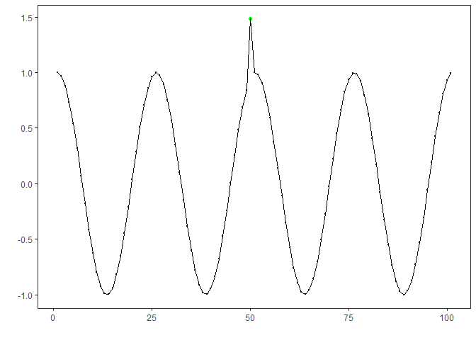
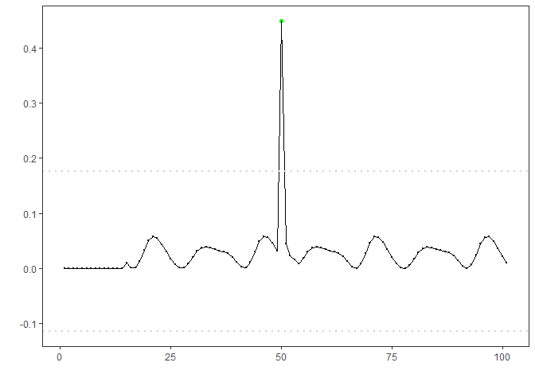

## Objective

This notebook demonstrates anomaly detection using an LSTM regressor
(`hanr_ml + ts_lstm`). The model predicts the next value capturing
temporal dependencies; anomalies are flagged when residuals exceed a
learned threshold. Steps: load packages/data, visualize, define and fit
the model, detect, evaluate, and plot results and residuals.

## Method at a glance

LSTM regression anomaly detection: Model-deviation detection using ML
regression: an LSTM forecaster predicts the next value from a sliding
window; large prediction errors are flagged as anomalies. Implemented
via DALToolbox regressors and thresholded with `harutils()`.

## What you will do

- understand the purpose of the example and when the technique is useful
- follow the workflow from data loading to model fitting and detection
- inspect the evaluation outputs and the diagnostic plots produced by
  Harbinger

### Prepare the Example

This setup anchors the notebook in the specific series used to examine
`hanr_ml + ts_lstm`. The semantic point is the one stated above: lSTM
regression anomaly detection: Model-deviation detection using ML
regression: an LSTM forecaster predicts the next value from a sliding
window; large prediction errors are flagged as anomalies, so the raw
signal needs to be visible before any fitting step hides that structure
behind model output.

    # Install Harbinger (only once, if needed)
    #install.packages("harbinger")

    # Pin reticulate to the local Python runtime used by neural examples.
    # Load required packages
    library(daltoolbox)

    ## Warning: package 'daltoolbox' was built under R version 4.5.3

    ## 
    ## Attaching package: 'daltoolbox'

    ## The following object is masked from 'package:base':
    ## 
    ##     transform

    library(harbinger) 
    library(tspredit)

    ## 
    ## Attaching package: 'tspredit'

    ## The following object is masked from 'package:harbinger':
    ## 
    ##     loadfulldata

    library(daltoolboxdp)

    # Load example datasets bundled with harbinger
    data(examples_anomalies)

    # Select a simple synthetic time series with labeled anomalies
    dataset <- examples_anomalies$simple
    head(dataset)

    ##       serie event
    ## 1 1.0000000 FALSE
    ## 2 0.9689124 FALSE
    ## 3 0.8775826 FALSE
    ## 4 0.7316889 FALSE
    ## 5 0.5403023 FALSE
    ## 6 0.3153224 FALSE

### Interpret the Result Visually

This first visual pass establishes what the method should react to in
the raw series. Keep the method summary in mind here, because lSTM
regression anomaly detection: Model-deviation detection using ML
regression: an LSTM forecaster predicts the next value from a sliding
window; large prediction errors are flagged as anomalies and the plot
tells you whether that structure is clean, weak, local, repeated, or
mixed with other effects.

    # Plot the time series
    har_plot(harbinger(), dataset$serie)

### Configure the Method

The choices below turn the central modeling idea into concrete
parameters. They matter because lSTM regression anomaly detection:
Model-deviation detection using ML regression: an LSTM forecaster
predicts the next value from a sliding window; large prediction errors
are flagged as anomalies, so each argument controls how strongly the
method will emphasize that pattern when it later produces anomaly flags.

    # Define LSTM-based regressor (hanr_ml + ts_lstm)
    # - input_size: window length; epochs: training iterations
    model <- hanr_ml(ts_lstm(ts_norm_gminmax(), input_size = 4, epochs = 100))

    # Fit the model
    model <- fit(model, dataset$serie)

### Run the Core Analysis

This is the moment where the notebook tests its central assumption on
actual data. After applying `hanr_ml + ts_lstm`, the important question
is whether the resulting anomaly flags really correspond to the pattern
implied by the method description above, rather than to arbitrary
numerical variation.

    # Detect anomalies (compute residuals and events)
    detection <- detect(model, dataset$serie)

    # Show only timestamps flagged as events
      print(detection |> dplyr::filter(event==TRUE))

    ##   idx event    type
    ## 1  50  TRUE anomaly

### Evaluate What Was Found

The evaluation asks whether the anomaly flags produced by
`hanr_ml + ts_lstm` match the labeled structure on this dataset. Read
the scores as evidence about the method’s assumptions in practice, not
as detached summary numbers.

    # Evaluate detections against ground-truth labels
      evaluation <- evaluate(model, detection$event, dataset$event)
      print(evaluation$confMatrix)

    ##           event      
    ## detection TRUE  FALSE
    ## TRUE      1     0    
    ## FALSE     0     100

### Interpret the Result Visually

This visual check puts the model output back on top of the original
signal. What matters now is whether the highlighted anomaly flags line
up with the structure suggested by the method, which is the real
semantic test of whether the example is teaching the right lesson.

    # Plot detections over the series
      har_plot(model, dataset$serie, detection, dataset$event)

    # Plot residual scores and threshold
      har_plot(model, attr(detection, "res"), detection, dataset$event, yline = attr(detection, "threshold"))

    ## Warning in read.dcf(file.path(p, "DESCRIPTION"), c("Package", "Version")):
    ## cannot open compressed file 'C:/R/R-4.5.0/library/harbinger/DESCRIPTION',
    ## probable reason 'No such file or directory'

    ## Warning: Using `size` aesthetic for lines was deprecated in ggplot2 3.4.0.
    ## ℹ Please use `linewidth` instead.
    ## ℹ The deprecated feature was likely used in the harbinger package.
    ##   Please report the issue to the authors.
    ## This warning is displayed once per session.
    ## Call `lifecycle::last_lifecycle_warnings()` to see where this warning was
    ## generated.

## References

- Goodfellow, I., Bengio, Y., Courville, A. (2016). Deep Learning. MIT
  Press.
- Hyndman, R. J., Athanasopoulos, G. (2021). Forecasting: Principles and
  Practice. OTexts.
