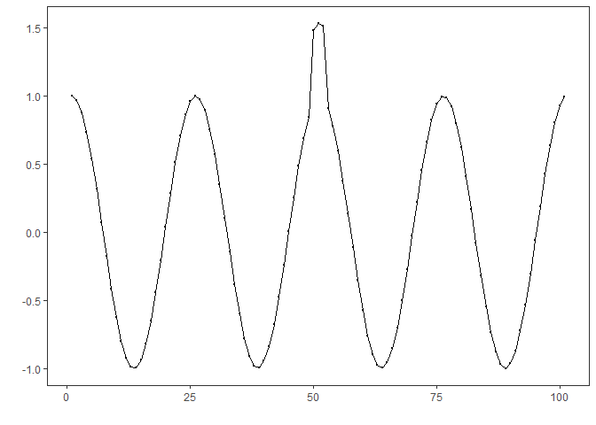
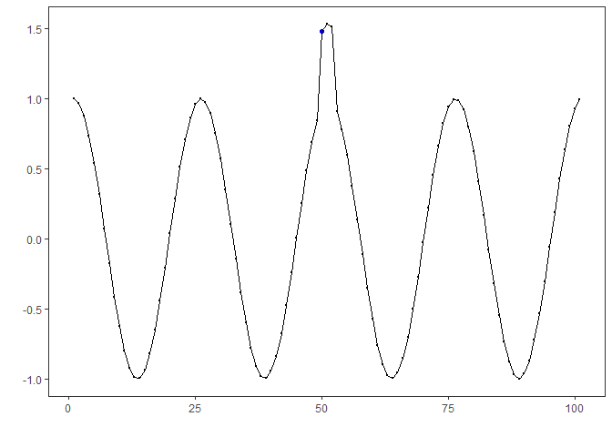
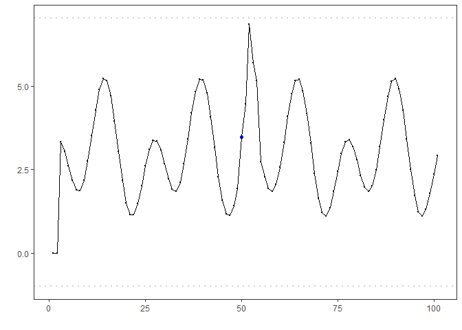

## Objective

DTW-based discord discovery uses sequence windows (seq &gt; 1) and flags
sequences far from any centroid as discords.

Steps: - Load and visualize a dataset with repeating sequences -
Configure and run `hanct_dtw(seq > 1)` - Inspect detections, evaluate,
and plot results

## Method at a glance

DTW-based discord anomaly detection: Dynamic Time Warping (DTW)
clustering over subsequences; windows with large DTW distance to their
nearest centroid are flagged as discords. Implementation wraps
`dtwclust` and thresholds via `harutils()`.

## What you will do

- understand the purpose of the example and when the technique is useful
- follow the workflow from data loading to model fitting and detection
- inspect the evaluation outputs and the diagnostic plots produced by
  Harbinger

### Prepare the Example

This setup anchors the notebook in the specific series used to examine
`hanct_dtw(seq > 1)`. The semantic point is the one stated above:
dTW-based discord anomaly detection: Dynamic Time Warping (DTW)
clustering over subsequences; windows with large DTW distance to their
nearest centroid are flagged as discords, so the raw signal needs to be
visible before any fitting step hides that structure behind model
output.

    # Install Harbinger (if needed)
    #install.packages("harbinger")

    # Load required packages
    library(daltoolbox)

    ## Warning: package 'daltoolbox' was built under R version 4.5.3

    ## 
    ## Attaching package: 'daltoolbox'

    ## The following object is masked from 'package:base':
    ## 
    ##     transform

    library(harbinger) 

    # Load example anomaly datasets
    data(examples_anomalies)

    # Select the sequence dataset
    dataset <- examples_anomalies$sequence
    head(dataset)

    ##       serie event
    ## 1 1.0000000 FALSE
    ## 2 0.9689124 FALSE
    ## 3 0.8775826 FALSE
    ## 4 0.7316889 FALSE
    ## 5 0.5403023 FALSE
    ## 6 0.3153224 FALSE

### Interpret the Result Visually

This first visual pass establishes what the method should react to in
the raw series. Keep the method summary in mind here, because dTW-based
discord anomaly detection: Dynamic Time Warping (DTW) clustering over
subsequences; windows with large DTW distance to their nearest centroid
are flagged as discords and the plot tells you whether that structure is
clean, weak, local, repeated, or mixed with other effects.

    # Plot the raw time series
    har_plot(harbinger(), dataset$serie)

### Configure the Method

The choices below turn the central modeling idea into concrete
parameters. They matter because dTW-based discord anomaly detection:
Dynamic Time Warping (DTW) clustering over subsequences; windows with
large DTW distance to their nearest centroid are flagged as discords, so
each argument controls how strongly the method will emphasize that
pattern when it later produces cluster-based anomaly flags.

    # Configure DTW-clustering for sequence discords (seq = 3)
    model <- hanct_dtw(3)

    # Fit the detector
    model <- fit(model, dataset$serie)

### Run the Core Analysis

This is the moment where the notebook tests its central assumption on
actual data. After applying `hanct_dtw(seq > 1)`, the important question
is whether the resulting cluster-based anomaly flags really correspond
to the pattern implied by the method description above, rather than to
arbitrary numerical variation.

    # Run detection
    detection <- detect(model, dataset$serie)

    # Show detected discord starts
    print(detection |> dplyr::filter(event == TRUE))

    ## [1] idx    event  type   seq    seqlen
    ## <0 rows> (or 0-length row.names)

### Evaluate What Was Found

The evaluation asks whether the cluster-based anomaly flags produced by
`hanct_dtw(seq > 1)` match the labeled structure on this dataset. Read
the scores as evidence about the method’s assumptions in practice, not
as detached summary numbers.

    # Evaluate detections against labels
    evaluation <- evaluate(model, detection$event, dataset$event)
    print(evaluation$confMatrix)

    ##           event      
    ## detection TRUE  FALSE
    ## TRUE      0     0    
    ## FALSE     1     100

### Interpret the Result Visually

This visual check puts the model output back on top of the original
signal. What matters now is whether the highlighted cluster-based
anomaly flags line up with the structure suggested by the method, which
is the real semantic test of whether the example is teaching the right
lesson.

    # Plot discords vs. ground truth
    har_plot(model, dataset$serie, detection, dataset$event)

    # Plot residual magnitude and decision thresholds
    har_plot(model, attr(detection, "res"), detection, dataset$event, yline = attr(detection, "threshold"))

    ## Warning: Using `size` aesthetic for lines was deprecated in ggplot2 3.4.0.
    ## ℹ Please use `linewidth` instead.
    ## ℹ The deprecated feature was likely used in the harbinger package.
    ##   Please report the issue at
    ##   <https://github.com/cefet-rj-dal/harbinger/issues>.
    ## This warning is displayed once per session.
    ## Call `lifecycle::last_lifecycle_warnings()` to see where this warning was
    ## generated.

## References

- Ogasawara, E., Salles, R., Porto, F., Pacitti, E. Event Detection in
  Time Series. Springer, 2025. <doi:10.1007/978-3-031-75941-3>
