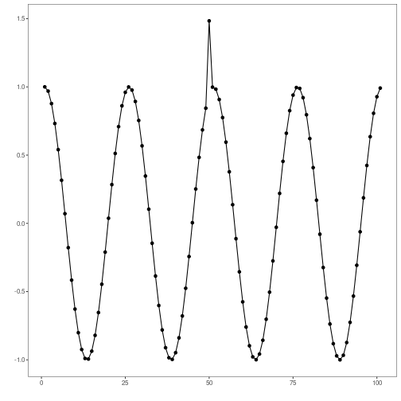
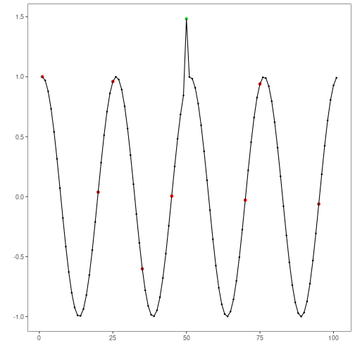

```r
# Harbinger Package
# version 1.1.707


#loading Harbinger
library(daltoolbox)
library(harbinger) 
```


```r
#loading the example database
data(examples_anomalies)
```


```r
#Using the simple time series 
dataset <- examples_anomalies$simple
head(dataset)
```

```
##       serie event
## 1 1.0000000 FALSE
## 2 0.9689124 FALSE
## 3 0.8775826 FALSE
## 4 0.7316889 FALSE
## 5 0.5403023 FALSE
## 6 0.3153224 FALSE
```


```r
#ploting the time series
plot_ts(x = 1:length(dataset$serie), y = dataset$serie)
```




```r
# establishing han_autoencoder method 
  model <- han_autoencoder(3, 2, sae_encode_decode, num_epochs = 1500)
```


```r
# fitting the model
  model <- fit(model, dataset$serie)
```


```r
# making detections
  detection <- detect(model, dataset$serie)
```


```r
# filtering detected events
  print(detection |> dplyr::filter(event==TRUE))
```

```
##   idx event    type
## 1   1  TRUE anomaly
## 2  20  TRUE anomaly
## 3  25  TRUE anomaly
## 4  35  TRUE anomaly
## 5  45  TRUE anomaly
## 6  50  TRUE anomaly
## 7  70  TRUE anomaly
## 8  75  TRUE anomaly
## 9  95  TRUE anomaly
```


```r
# evaluating the detections
  evaluation <- evaluate(model, detection$event, dataset$event)
  print(evaluation$confMatrix)
```

```
##           event      
## detection TRUE  FALSE
## TRUE      1     8    
## FALSE     0     92
```


```r
# ploting the results
  grf <- har_plot(model, dataset$serie, detection, dataset$event)
  plot(grf)
```



