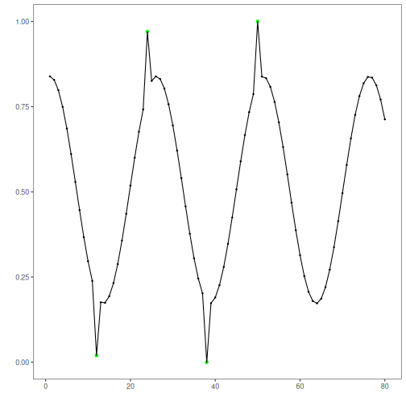
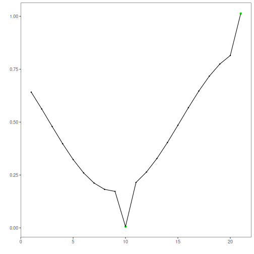
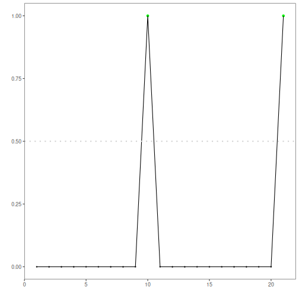

k-NN classification anomaly detector: Supervised anomaly detection using k-NN classification on labeled data; positive-class probabilities above a threshold indicate events.

Objectives: 
This Rmd shows supervised anomaly classification using `hanc_ml` with k-Nearest Neighbors (`cla_knn`). It uses labeled events, a simple train/test split, and min–max normalization. Steps: load packages/data, visualize, preprocess, define and fit the classifier, detect, evaluate, and plot results.


``` r
# Install Harbinger (only once, if needed)
#install.packages("harbinger")
```


``` r
# Load required packages
library(daltoolbox)
library(harbinger) 
```


``` r
# Load example datasets bundled with harbinger
data(examples_anomalies)
```


``` r
# Use the "tt" time series (labeled)
dataset <- examples_anomalies$tt

head(dataset)
```

```
##       serie event
## 1 1.0000000 FALSE
## 2 0.9689124 FALSE
## 3 0.8775826 FALSE
## 4 0.7316889 FALSE
## 5 0.5403023 FALSE
## 6 0.3153224 FALSE
```


``` r
# Plot the time series
har_plot(harbinger(), dataset$serie)
```


``` r
# Data preprocessing: split and scale


train <- dataset[1:80,]
test <- dataset[-(1:80),]

norm <- minmax()
norm <- fit(norm, train)
train_n <- transform(norm, train)
summary(train_n)
```

```
##      serie          event        
##  Min.   :0.0000   Mode :logical  
##  1st Qu.:0.2859   FALSE:76       
##  Median :0.5348   TRUE :4        
##  Mean   :0.5221                  
##  3rd Qu.:0.7587                  
##  Max.   :1.0000
```


``` r
# Define k-NN classifier for events (hanc_ml + cla_knn)
model <- hanc_ml(cla_knn("event", c("FALSE", "TRUE"), k=3))
```


``` r
# Fit the model on training data
model <- fit(model, train_n)
detection <- detect(model, train_n)
print(detection |> dplyr::filter(event==TRUE))
```

```
##   idx event    type
## 1  12  TRUE anomaly
## 2  24  TRUE anomaly
## 3  38  TRUE anomaly
## 4  50  TRUE anomaly
```

``` r
# Evaluate training performance
evaluation <- evaluate(model, detection$event, as.logical(train_n$event))
print(evaluation$confMatrix)
```

```
##           event      
## detection TRUE  FALSE
## TRUE      4     0    
## FALSE     0     76
```


``` r
# Plot training detections
  har_plot(model, train_n$serie, detection, as.logical(train_n$event))
```




``` r
# Prepare test data (apply same scaler)
  test_n <- transform(norm, test)
```


``` r
# Detect and evaluate on test data
  detection <- detect(model, test_n)

  print(detection |> dplyr::filter(event==TRUE))
```

```
##   idx event    type
## 1  10  TRUE anomaly
## 2  21  TRUE anomaly
```

``` r
  evaluation <- evaluate(model, detection$event, as.logical(test_n$event))
  print(evaluation$confMatrix)
```

```
##           event      
## detection TRUE  FALSE
## TRUE      2     0    
## FALSE     0     19
```


``` r
# Plot test detections
  har_plot(model, test_n$serie, detection, as.logical(test_n$event))
```




``` r
# Plot residual scores and threshold
har_plot(model, attr(detection, "res"), detection, test_n$event, yline = attr(detection, "threshold"))
```



References 
- Bishop, C. M. (2006). Pattern Recognition and Machine Learning. Springer.
- Hyndman, R. J., Athanasopoulos, G. (2021). Forecasting: Principles and Practice. OTexts.
- Ogasawara, E., Salles, R., Porto, F., Pacitti, E. Event Detection in Time Series. Springer, 2025. doi:10.1007/978-3-031-75941-3
