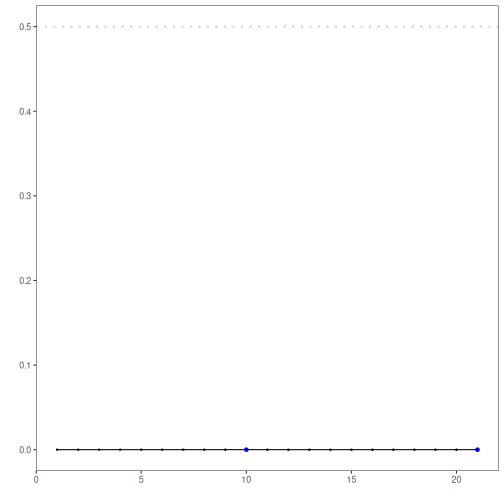

# Overview

This Rmd shows a simple supervised baseline for anomaly classification using `hanc_ml` with a Majority Classifier (`cla_majority`). It predicts the most frequent class in training. Steps: load packages/data, visualize, preprocess (split + normalize), define and fit, detect, evaluate, and plot results.


``` r
# Install Harbinger (only once, if needed)
#install.packages("harbinger")
```


``` r
# Load required packages
library(daltoolbox)
library(harbinger) 
```


``` r
# Load example datasets bundled with harbinger
data(examples_anomalies)
```


``` r
# Use the "tt" time series (labeled)
dataset <- examples_anomalies$tt

head(dataset)
```

```
##       serie event
## 1 1.0000000 FALSE
## 2 0.9689124 FALSE
## 3 0.8775826 FALSE
## 4 0.7316889 FALSE
## 5 0.5403023 FALSE
## 6 0.3153224 FALSE
```


``` r
# Plot the time series
har_plot(harbinger(), dataset$serie)
```


``` r
# Data preprocessing: split and scale


train <- dataset[1:80,]
test <- dataset[-(1:80),]

norm <- minmax()
norm <- fit(norm, train)
train_n <- transform(norm, train)
summary(train_n)
```

```
##      serie          event        
##  Min.   :0.0000   Mode :logical  
##  1st Qu.:0.2859   FALSE:76       
##  Median :0.5348   TRUE :4        
##  Mean   :0.5221                  
##  3rd Qu.:0.7587                  
##  Max.   :1.0000
```


``` r
# Define Majority Classifier for events (hanc_ml + cla_majority)
model <- hanc_ml(cla_majority("event", c("FALSE", "TRUE")))
```


``` r
# Fit the model on training data
model <- fit(model, train_n)
detection <- detect(model, train_n)
print(detection |> dplyr::filter(event==TRUE))
```

```
## [1] idx   event type 
## <0 rows> (or 0-length row.names)
```

``` r
# Evaluate training performance
evaluation <- evaluate(model, detection$event, as.logical(train_n$event))
print(evaluation$confMatrix)
```

```
##           event      
## detection TRUE  FALSE
## TRUE      0     0    
## FALSE     4     76
```


``` r
# Plot training detections
  har_plot(model, train_n$serie, detection, as.logical(train_n$event))
```


``` r
# Prepare test data (apply same scaler)
  test_n <- transform(norm, test)
```


``` r
# Detect and evaluate on test data
  detection <- detect(model, test_n)

  print(detection |> dplyr::filter(event==TRUE))
```

```
## [1] idx   event type 
## <0 rows> (or 0-length row.names)
```

``` r
  evaluation <- evaluate(model, detection$event, as.logical(test_n$event))
  print(evaluation$confMatrix)
```

```
##           event      
## detection TRUE  FALSE
## TRUE      0     0    
## FALSE     2     19
```


``` r
# Plot test detections
  har_plot(model, test_n$serie, detection, as.logical(test_n$event))
```


``` r
# Plot residual scores and threshold
  har_plot(model, attr(detection, "res"), detection, test_n$event, yline = attr(detection, "threshold"))
```


