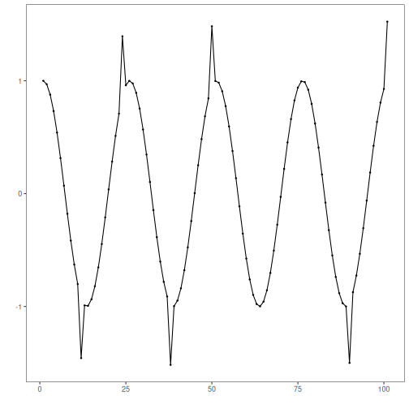
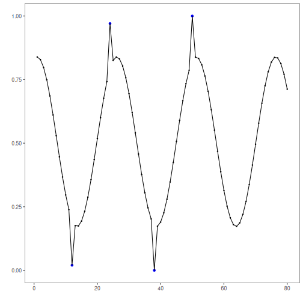
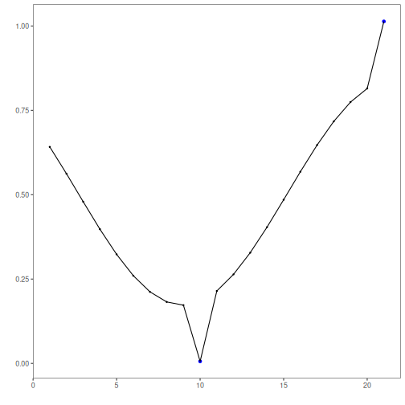
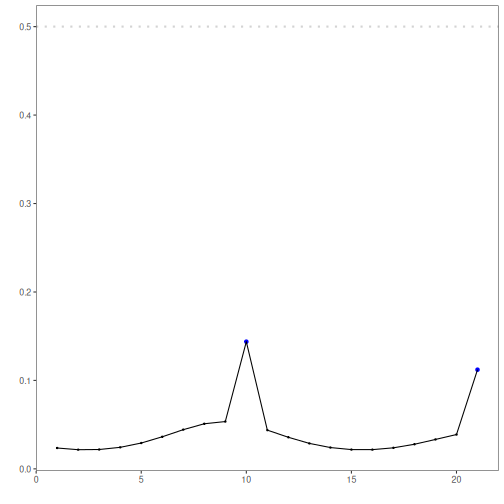

This tutorial shows supervised anomaly detection via Naive Bayes classification over a labeled train/test split. We will:

- Load a train/test dataset and visualize it
- Normalize features, train a Naive Bayes classifier, and evaluate on train and test
- Plot detections and residual magnitudes


``` r
# Install Harbinger (if needed)
#install.packages("harbinger")
```


``` r
# Load required packages
library(daltoolbox)
library(harbinger) 
```


``` r
# Load example anomaly datasets
data(examples_anomalies)
```


``` r
# Select the train/test dataset
dataset <- examples_anomalies$tt

head(dataset)
```

```
##       serie event
## 1 1.0000000 FALSE
## 2 0.9689124 FALSE
## 3 0.8775826 FALSE
## 4 0.7316889 FALSE
## 5 0.5403023 FALSE
## 6 0.3153224 FALSE
```


``` r
# Plot the raw time series
har_plot(harbinger(), dataset$serie)
```




``` r
# Split into train/test and normalize features
train <- dataset[1:80,]
test <- dataset[-(1:80),]

norm <- minmax()
norm <- fit(norm, train)
train_n <- transform(norm, train)
summary(train_n)
```

```
##      serie          event        
##  Min.   :0.0000   Mode :logical  
##  1st Qu.:0.2859   FALSE:76       
##  Median :0.5348   TRUE :4        
##  Mean   :0.5221                  
##  3rd Qu.:0.7587                  
##  Max.   :1.0000
```


``` r
# Configure NB classifier
model <- hanc_ml(cla_nb("event", c("FALSE", "TRUE")))
```


``` r
# Fit on training data, evaluate on train
model <- fit(model, train_n)
detection <- detect(model, train_n)
print(detection |> dplyr::filter(event == TRUE))
```

```
## [1] idx   event type 
## <0 linhas> (ou row.names de comprimento 0)
```

``` r
evaluation <- evaluate(model, detection$event, as.logical(train_n$event))
print(evaluation$confMatrix)
```

```
##           event      
## detection TRUE  FALSE
## TRUE      0     0    
## FALSE     4     76
```


``` r
# Plot training detections
har_plot(model, train_n$serie, detection, as.logical(train_n$event))
```




``` r
# Prepare normalized test set
test_n <- transform(norm, test)
```


``` r
# Detect and evaluate on test
detection <- detect(model, test_n)
print(detection |> dplyr::filter(event == TRUE))
```

```
## [1] idx   event type 
## <0 linhas> (ou row.names de comprimento 0)
```

``` r
evaluation <- evaluate(model, detection$event, as.logical(test_n$event))
print(evaluation$confMatrix)
```

```
##           event      
## detection TRUE  FALSE
## TRUE      0     0    
## FALSE     2     19
```


``` r
# Plot test detections
har_plot(model, test_n$serie, detection, as.logical(test_n$event))
```




``` r
# Plot residual magnitude and decision threshold
har_plot(model, attr(detection, "res"), detection, test_n$event, yline = attr(detection, "threshold"))
```


