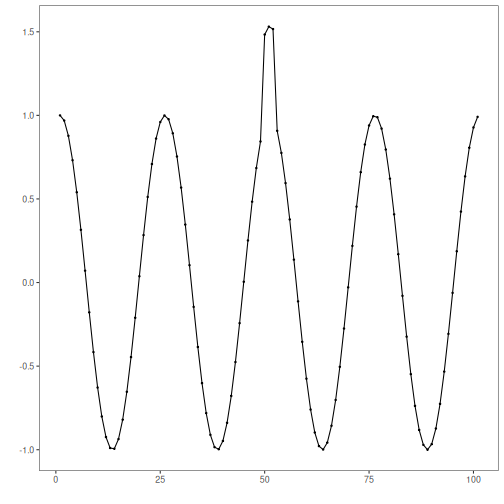
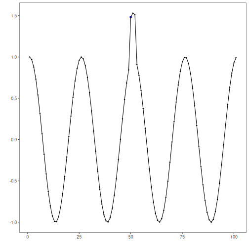
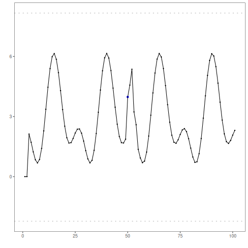

DTW-based discord anomaly detection: Dynamic Time Warping (DTW) clustering over subsequences; windows with large DTW distance to their nearest centroid are flagged as discords. Implementation wraps `dtwclust` and thresholds via `harutils()`.

DTW-based discord discovery uses sequence windows (seq > 1) and flags sequences far from any centroid as discords. 

Steps:
- Load and visualize a dataset with repeating sequences
- Configure and run `hanct_dtw(seq > 1)`
- Inspect detections, evaluate, and plot results


``` r
# Install Harbinger (if needed)
#install.packages("harbinger")
```


``` r
# Load required packages
library(daltoolbox)
library(harbinger) 
```


``` r
# Load example anomaly datasets
data(examples_anomalies)
```


``` r
# Select the sequence dataset
dataset <- examples_anomalies$sequence
head(dataset)
```

```
##       serie event
## 1 1.0000000 FALSE
## 2 0.9689124 FALSE
## 3 0.8775826 FALSE
## 4 0.7316889 FALSE
## 5 0.5403023 FALSE
## 6 0.3153224 FALSE
```


``` r
# Plot the raw time series
har_plot(harbinger(), dataset$serie)
```




``` r
# Configure DTW-clustering for sequence discords (seq = 3)
model <- hanct_dtw(3)
```


``` r
# Fit the detector
model <- fit(model, dataset$serie)
```


``` r
# Run detection
detection <- detect(model, dataset$serie)
```


``` r
# Show detected discord starts
print(detection |> dplyr::filter(event == TRUE))
```

```
##   idx event    type seq seqlen
## 1  52  TRUE discord   3      3
```


``` r
# Evaluate detections against labels
evaluation <- evaluate(model, detection$event, dataset$event)
print(evaluation$confMatrix)
```

```
##           event      
## detection TRUE  FALSE
## TRUE      0     1    
## FALSE     1     99
```


``` r
# Plot discords vs. ground truth
har_plot(model, dataset$serie, detection, dataset$event)
```




``` r
# Plot residual magnitude and decision thresholds
har_plot(model, attr(detection, "res"), detection, dataset$event, yline = attr(detection, "threshold"))
```



References 
- Ogasawara, E., Salles, R., Porto, F., Pacitti, E. Event Detection in Time Series. Springer, 2025. doi:10.1007/978-3-031-75941-3

