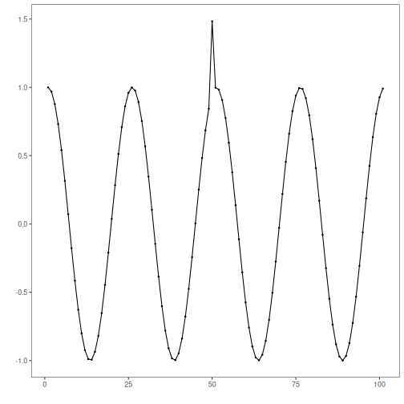

ARIMA regression anomaly detection: This detector fits an ARIMA(p, d, q) model to the series and uses large standardized residuals as anomaly evidence. After estimating the model, residual magnitudes are summarized via a distance function and thresholded using outlier heuristics provided by `harutils()`.

The ARIMA-based anomaly detector fits an ARIMA model to the time series and flags large residuals as anomalies. In this walkthrough we will:

- Load a synthetic anomaly dataset and visualize it
- Configure and run the ARIMA detector (`hanr_arima`)
- Inspect detections, evaluate against ground truth, and plot residuals and thresholds


``` r
# Install Harbinger (if needed)
#install.packages("harbinger")
```


``` r
# Load required packages
library(daltoolbox)
library(harbinger) 
```


``` r
# Load example anomaly datasets
data(examples_anomalies)
```


``` r
# Select a simple anomaly dataset
dataset <- examples_anomalies$simple
head(dataset)
```

```
##       serie event
## 1 1.0000000 FALSE
## 2 0.9689124 FALSE
## 3 0.8775826 FALSE
## 4 0.7316889 FALSE
## 5 0.5403023 FALSE
## 6 0.3153224 FALSE
```


``` r
# Plot the raw time series
har_plot(harbinger(), dataset$serie)
```




``` r
# Configure ARIMA-based anomaly detector
model <- hanr_arima()
```


``` r
# Fit the detector (estimates ARIMA order and caches parameters)
model <- fit(model, dataset$serie)
```


``` r
# Run detection to compute residual magnitudes and flags
detection <- detect(model, dataset$serie)
```


``` r
# Show detected anomaly indices
print(detection |> dplyr::filter(event == TRUE))
```

```
##   idx event    type
## 1  50  TRUE anomaly
```


``` r
# Evaluate detections against labeled events
evaluation <- evaluate(model, detection$event, dataset$event)
print(evaluation$confMatrix)
```

```
##           event      
## detection TRUE  FALSE
## TRUE      1     0    
## FALSE     0     100
```


``` r
# Plot detections vs. ground truth
har_plot(model, dataset$serie, detection, dataset$event)
```


``` r
# Plot the residual magnitude and the decision thresholds
har_plot(model, attr(detection, "res"), detection, dataset$event, yline = attr(detection, "threshold"))
```


References 
- Box, G. E. P., Jenkins, G. M., Reinsel, G. C., Ljung, G. M. (2015). Time Series Analysis: Forecasting and Control. Wiley.
