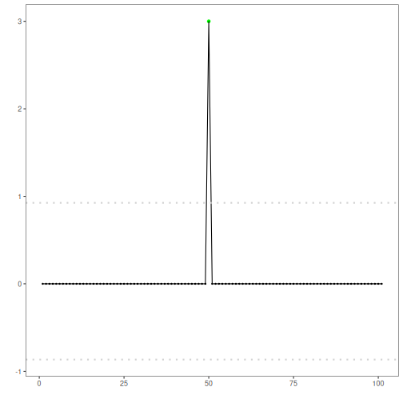

Ensemble anomaly detection: Majority-vote ensemble across multiple detectors, optionally with temporal fuzzification to combine nearby detections into a single event. Each base detector contributes a vote; final events reflect consensus.

Objectives: 
This Rmd demonstrates anomaly detection via an ensemble of residual-based detectors using `har_ensemble(...)`. Multiple base detectors (e.g., FBIAD, ARIMA, EMD) vote to produce a final event decision. Steps: load packages/data, visualize, define ensemble, fit, detect, evaluate, and plot results and residuals.


``` r
# Install Harbinger (only once, if needed)
#install.packages("harbinger")
```


``` r
# Load required packages
library(daltoolbox)
library(harbinger) 
```


``` r
# Load example datasets bundled with harbinger
data(examples_anomalies)
```


``` r
# Select a simple synthetic time series with labeled anomalies
dataset <- examples_anomalies$simple
head(dataset)
```

```
##       serie event
## 1 1.0000000 FALSE
## 2 0.9689124 FALSE
## 3 0.8775826 FALSE
## 4 0.7316889 FALSE
## 5 0.5403023 FALSE
## 6 0.3153224 FALSE
```


``` r
# Plot the time series
har_plot(harbinger(), dataset$serie)
```


``` r
# Define the ensemble of base detectors
  model <- har_ensemble(hanr_fbiad(), hanr_arima(), hanr_emd())
```


``` r
# Fit the model
  model <- fit(model, dataset$serie)
```


``` r
# Detect anomalies via ensemble voting
  detection <- detect(model, dataset$serie)
```


``` r
# Show only timestamps flagged as events
  print(detection |> dplyr::filter(event==TRUE))
```

```
##   idx event    type
## 1  50  TRUE anomaly
```


``` r
# Evaluate detections against ground-truth labels
  evaluation <- evaluate(model, detection$event, dataset$event)
  print(evaluation$confMatrix)
```

```
##           event      
## detection TRUE  FALSE
## TRUE      1     0    
## FALSE     0     100
```


``` r
# Plot detections over the series
  har_plot(model, dataset$serie, detection, dataset$event)
```


``` r
# Plot residual scores and threshold
  har_plot(model, attr(detection, "res"), detection, dataset$event, yline = attr(detection, "threshold"))
```



References 
- Ogasawara, E., Salles, R., Porto, F., Pacitti, E. Event Detection in Time Series. Springer, 2025. doi:10.1007/978-3-031-75941-3
