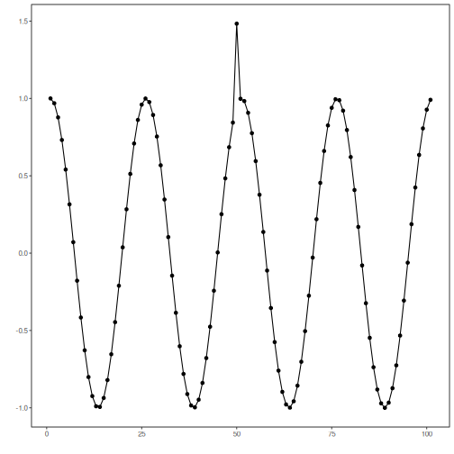
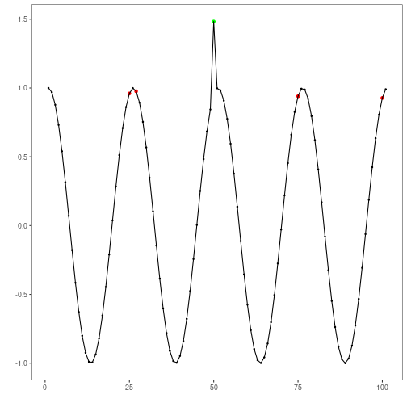
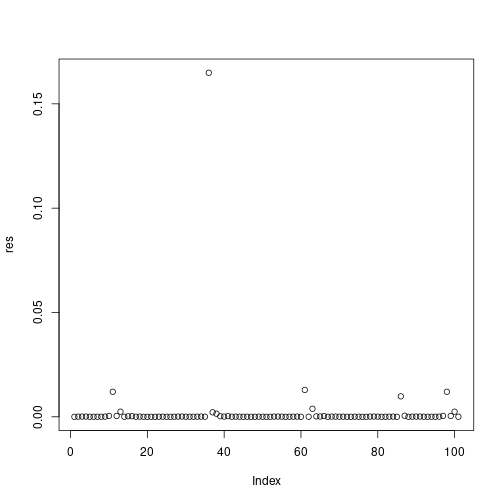

``` r
# Harbinger Package
# version 1.1.707


#loading Harbinger
library(daltoolbox)
library(harbinger) 
```


``` r
#loading the example database
data(examples_anomalies)
```


``` r
#Using the simple time series
dataset <- examples_anomalies$simple
head(dataset)
```

```
##       serie event
## 1 1.0000000 FALSE
## 2 0.9689124 FALSE
## 3 0.8775826 FALSE
## 4 0.7316889 FALSE
## 5 0.5403023 FALSE
## 6 0.3153224 FALSE
```


``` r
#ploting the time series
plot_ts(x = 1:length(dataset$serie), y = dataset$serie)
```




``` r
# establishing conv1d method 
  model <- hanr_ml(ts_conv1d(ts_norm_gminmax(), input_size=4, epochs=10000))
```


``` r
# fitting the model
  model <- fit(model, dataset$serie)
```


``` r
# making detections
  detection <- detect(model, dataset$serie)
```

```
## Warning in obj$res[obj$non_na] <- res: number of items to replace is not a multiple of replacement length
```


``` r
# filtering detected events
  print(detection |> dplyr::filter(event==TRUE))
```

```
##   idx event    type
## 1  24  TRUE anomaly
## 2  49  TRUE anomaly
## 3  74  TRUE anomaly
## 4  78  TRUE anomaly
## 5  99  TRUE anomaly
```


``` r
# evaluating the detections
  evaluation <- evaluate(model, detection$event, dataset$event)
  print(evaluation$confMatrix)
```

```
##           event      
## detection TRUE  FALSE
## TRUE      0     5    
## FALSE     1     95
```


``` r
# ploting the results
  grf <- har_plot(model, dataset$serie, detection, dataset$event)
  plot(grf)
```




``` r
# ploting the results
  res <-  attr(detection, "res")
  plot(res)
```


