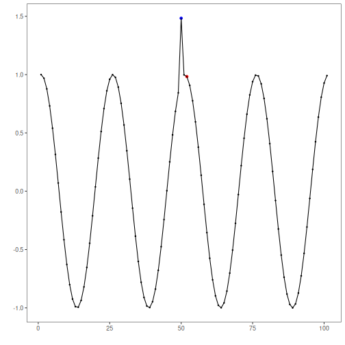
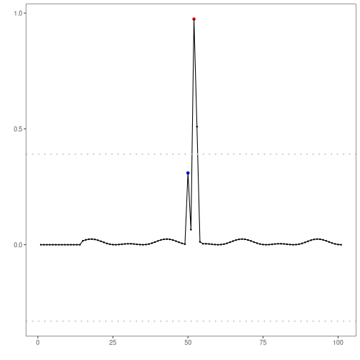

# Overview

This Rmd demonstrates anomaly detection using an Extreme Learning Machine regressor (`hanr_ml + ts_elm`). The model predicts the next value and flags anomalies when residuals exceed a learned threshold. Steps: load packages/data, visualize, define and fit the model, detect, evaluate, and plot results and residuals.


``` r
# Install Harbinger (only once, if needed)
#install.packages("harbinger")
```


``` r
# Load required packages
library(daltoolbox)
library(harbinger) 
library(tspredit)
```


``` r
# Load example datasets bundled with harbinger
data(examples_anomalies)
```


``` r
# Select a simple synthetic time series with labeled anomalies
dataset <- examples_anomalies$simple
head(dataset)
```

```
##       serie event
## 1 1.0000000 FALSE
## 2 0.9689124 FALSE
## 3 0.8775826 FALSE
## 4 0.7316889 FALSE
## 5 0.5403023 FALSE
## 6 0.3153224 FALSE
```


``` r
# Plot the time series
har_plot(harbinger(), dataset$serie)
```


``` r
# Define ELM-based regressor for anomaly detection (hanr_ml + ts_elm)
# - input_size controls the window length; nhid/actfun tune the hidden layer
  model <- hanr_ml(ts_elm(ts_norm_gminmax(), input_size=4, nhid=3, actfun="purelin"))
```


``` r
# Fit the model
  model <- fit(model, dataset$serie)
```


``` r
# Detect anomalies (compute residuals and events)
  detection <- detect(model, dataset$serie)
```


``` r
# Show only timestamps flagged as events
  print(detection |> dplyr::filter(event==TRUE))
```

```
##   idx event    type
## 1  52  TRUE anomaly
```


``` r
# Evaluate detections against ground-truth labels
  evaluation <- evaluate(model, detection$event, dataset$event)
  print(evaluation$confMatrix)
```

```
##           event      
## detection TRUE  FALSE
## TRUE      0     1    
## FALSE     1     99
```


``` r
# Plot detections over the series
  har_plot(model, dataset$serie, detection, dataset$event)
```




``` r
# Plot residual scores and threshold
  har_plot(model, attr(detection, "res"), detection, dataset$event, yline = attr(detection, "threshold"))
```


