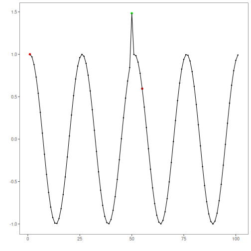
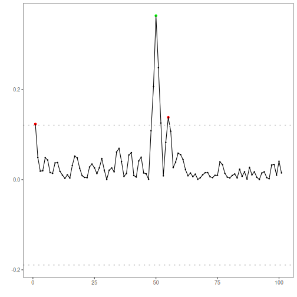

REMD combines EMD-based decomposition with ARIMA modeling on the high-frequency component to detect anomalies. In this tutorial we:

- Load and visualize a simple anomaly dataset
- Configure and run the REMD detector (`hanr_remd`)
- Inspect detections, evaluate, and plot residual magnitudes


``` r
# Install Harbinger (if needed)
#install.packages("harbinger")
```


``` r
# Load required packages
library(daltoolbox)
library(harbinger) 
```


``` r
# Load example anomaly datasets
data(examples_anomalies)
```


``` r
# Select a simple anomaly dataset
dataset <- examples_anomalies$simple
head(dataset)
```

```
##       serie event
## 1 1.0000000 FALSE
## 2 0.9689124 FALSE
## 3 0.8775826 FALSE
## 4 0.7316889 FALSE
## 5 0.5403023 FALSE
## 6 0.3153224 FALSE
```


``` r
# Plot the raw time series
har_plot(harbinger(), dataset$serie)
```


``` r
# Configure the REMD detector
model <- hanr_remd()
```


``` r
# Fit the detector
model <- fit(model, dataset$serie)
```


``` r
# Run detection
detection <- detect(model, dataset$serie)
```


``` r
# Show detected anomaly indices
print(detection |> dplyr::filter(event == TRUE))
```

```
##   idx event    type
## 1  51  TRUE anomaly
## 2  53  TRUE anomaly
```


``` r
# Evaluate detections against labels
evaluation <- evaluate(model, detection$event, dataset$event)
print(evaluation$confMatrix)
```

```
##           event      
## detection TRUE  FALSE
## TRUE      0     2    
## FALSE     1     98
```


``` r
# Plot detections vs. ground truth
har_plot(model, dataset$serie, detection, dataset$event)
```




``` r
# Plot residual magnitude and decision thresholds
har_plot(model, attr(detection, "res"), detection, dataset$event, yline = attr(detection, "threshold"))
```


