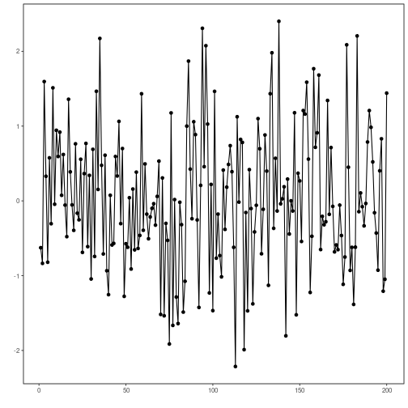
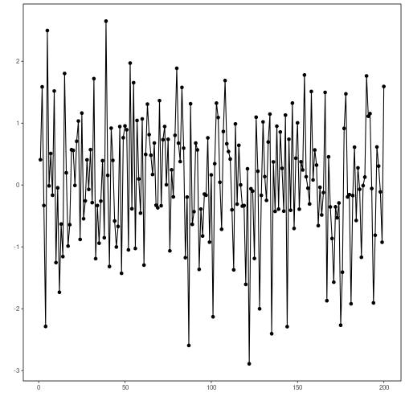
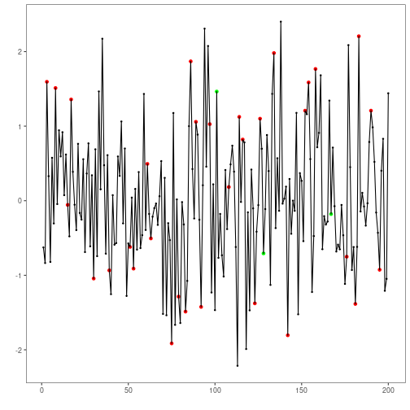
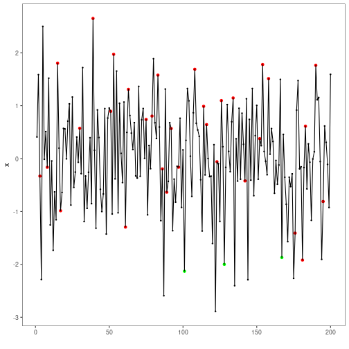
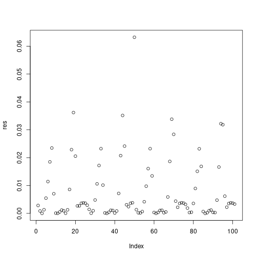

```r
# Harbinger Package
# version 1.1.707


#loading Harbinger
library(daltoolbox)
library(harbinger) 
load_library("ggplot2")
```

```
## Error in load_library("ggplot2"): could not find function "load_library"
```


```r
data("examples_harbinger")
dataset <- examples_harbinger$multidimensional
dataset$event <- FALSE
dataset$event[c(101,128,167)] <- TRUE
```


```r
head(dataset)
```

```
##        serie           x event
## 1 -0.6264538  0.40940184 FALSE
## 2 -0.8356286  1.58658843 FALSE
## 3  1.5952808 -0.33090780 FALSE
## 4  0.3295078 -2.28523554 FALSE
## 5 -0.8204684  2.49766159 FALSE
## 6  0.5757814 -0.01339952 FALSE
```


```r
#ploting the time series
plot_ts(x = 1:length(dataset$serie), y = dataset$serie)
```




```r
#ploting the time x
plot_ts(x = 1:length(dataset$x), y = dataset$x)
```




```r
model <- fit(hmu_pca(), dataset[,1:2])
pca_detection <- detect(model, dataset[,1:2])
```


```r
grf <- har_plot(model, dataset$serie, pca_detection, dataset$event)
grf <- grf + ylab("serie")
```

```
## Error in ylab("serie"): could not find function "ylab"
```

```r
plot(grf)
```




```r
grf <- har_plot(model, dataset$x, pca_detection, dataset$event)
grf <- grf + ylab("x")
```

```
## Error in ylab("x"): could not find function "ylab"
```

```r
plot(grf)
```




```r
# ploting the results
  res <-  attr(detection, "res")
  plot(res)
```


