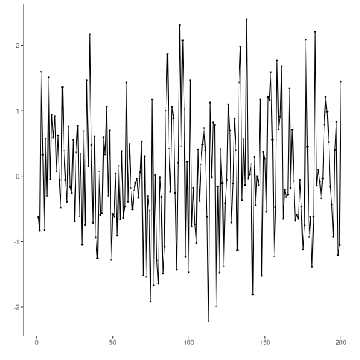
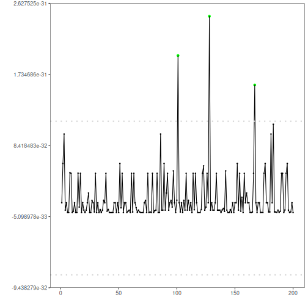

``` r
# Installing Harbinger
#install.packages"harbinger")
```


``` r
# Loading Harbinger
library(daltoolbox)
library(harbinger) 
library(ggplot2)
```


``` r
data("examples_harbinger")
dataset <- examples_harbinger$multidimensional
dataset$event <- FALSE
dataset$event[c(101,128,167)] <- TRUE
```


``` r
head(dataset)
```

```
##        serie           x event
## 1 -0.6264538  0.40940184 FALSE
## 2 -0.8356286  1.58658843 FALSE
## 3  1.5952808 -0.33090780 FALSE
## 4  0.3295078 -2.28523554 FALSE
## 5 -0.8204684  2.49766159 FALSE
## 6  0.5757814 -0.01339952 FALSE
```


``` r
# ploting the time series
har_plot(harbinger(), dataset$serie)
```




``` r
# ploting the time x
har_plot(harbinger(), dataset$x)
```


``` r
model <- fit(hmu_pca(), dataset[,1:2])
detection <- detect(model, dataset[,1:2])
```


``` r
grf <- har_plot(model, dataset$serie, detection, dataset$event)
grf <- grf + ylab("serie")
```


``` r
grf <- har_plot(model, dataset$x, detection, dataset$event)
grf <- grf + ylab("x")
```


``` r
# plotting the results
  har_plot(model, attr(detection, "res"), detection, dataset$event, yline = attr(detection, "threshold"))
```


