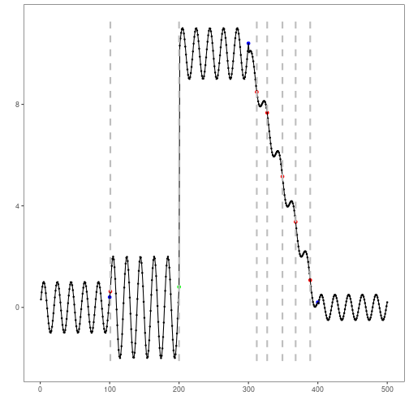

``` r
# Harbinger Package
# version 1.1.707


#loading Harbinger
library(daltoolbox)
library(harbinger) 
```


``` r
#loading the example database
data(examples_changepoints)
```


``` r
#Using the simple time series 
dataset <- examples_changepoints$complex
head(dataset)
```

```
##       serie event
## 1 0.3129618 FALSE
## 2 0.5944808 FALSE
## 3 0.8162731 FALSE
## 4 0.9560557 FALSE
## 5 0.9997847 FALSE
## 6 0.9430667 FALSE
```


``` r
#ploting the time series
plot_ts(x = 1:length(dataset$serie), y = dataset$serie)
```


``` r
# establishing change point method 
  model <- hcp_binseg(Q=10)
```


``` r
# fitting the model
  model <- fit(model, dataset$serie)
```


``` r
# making detections
  detection <- detect(model, dataset$serie)
```


``` r
# filtering detected events
  print(detection |> dplyr::filter(event==TRUE))
```

```
##   idx event        type
## 1 101  TRUE changepoint
## 2 200  TRUE changepoint
## 3 312  TRUE changepoint
## 4 327  TRUE changepoint
## 5 349  TRUE changepoint
## 6 368  TRUE changepoint
## 7 389  TRUE changepoint
```


``` r
# evaluating the detections
  evaluation <- evaluate(model, detection$event, dataset$event)
  print(evaluation$confMatrix)
```

```
##           event      
## detection TRUE  FALSE
## TRUE      1     6    
## FALSE     3     490
```


``` r
# ploting the results
  grf <- har_plot(model, dataset$serie, detection, dataset$event)
  plot(grf)
```



