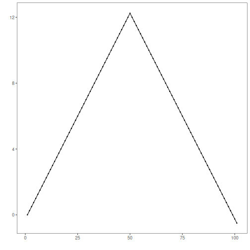
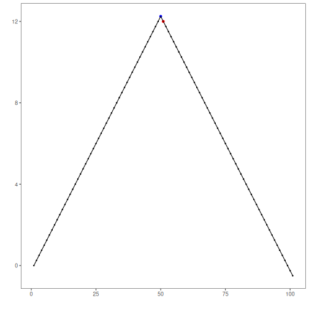
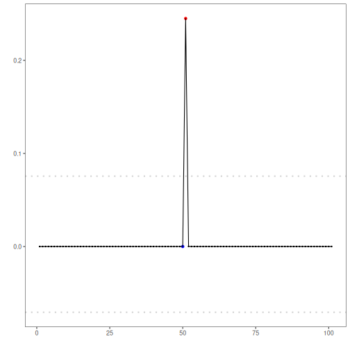

``` r
# Installing Harbinger
install.packages("harbinger")
```

```

```


``` r
# Loading Harbinger
library(daltoolbox)
library(harbinger) 
```


``` r
# loading the example database
data(examples_changepoints)
```


``` r
# Using the simple time series 
dataset <- examples_changepoints$simple
head(dataset)
```

```
##   serie event
## 1  0.00 FALSE
## 2  0.25 FALSE
## 3  0.50 FALSE
## 4  0.75 FALSE
## 5  1.00 FALSE
## 6  1.25 FALSE
```


``` r
# ploting the time series
har_plot(harbinger(), dataset$serie)
```




``` r
# establishing change finder ets method 
  model <- hcp_cf_ets(sw_size = 10)
```


``` r
# fitting the model
  model <- fit(model, dataset$serie)
```


``` r
# making detections
  detection <- detect(model, dataset$serie)
```


``` r
# filtering detected events
  print(detection |> dplyr::filter(event==TRUE))
```

```
##   idx event    type
## 1  51  TRUE anomaly
```


``` r
# evaluating the detections
  evaluation <- evaluate(model, detection$event, dataset$event)
  print(evaluation$confMatrix)
```

```
##           event      
## detection TRUE  FALSE
## TRUE      0     1    
## FALSE     1     99
```


``` r
# plotting the results
  har_plot(model, dataset$serie, detection, dataset$event)
```




``` r
# plotting the residuals
  har_plot(model, attr(detection, "res"), detection, dataset$event, yline = attr(detection, "threshold"))
```


