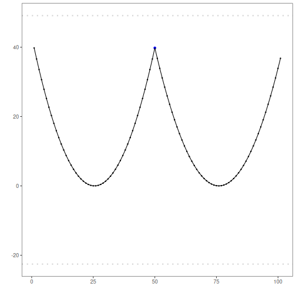

ChangeFinder with linear regression: ChangeFinder with linear regression models residual deviations and applies a second-stage smoothing/thresholding to expose structural changes. Thresholding is done via `harutils()`.

Objectives: This Rmd demonstrates change-point detection using Conformal Forecasting with a Linear Regression forecaster (`hcp_cf_lr`). The method scores deviations from short-term predictions and flags structural changes when nonconformity exceeds a learned threshold. Steps: load packages/data, visualize, define model (window size), fit, detect, evaluate, and plot both detections and residuals.


``` r
# Install Harbinger (only once, if needed)
#install.packages("harbinger")
```


``` r
# Load required packages
library(daltoolbox)
library(harbinger) 
```


``` r
# Load example datasets bundled with harbinger
data(examples_changepoints)
```


``` r
# Select a simple synthetic time series with labeled change-points
dataset <- examples_changepoints$simple
head(dataset)
```

```
##   serie event
## 1  0.00 FALSE
## 2  0.25 FALSE
## 3  0.50 FALSE
## 4  0.75 FALSE
## 5  1.00 FALSE
## 6  1.25 FALSE
```


``` r
# Plot the time series
har_plot(harbinger(), dataset$serie)
```


``` r
# Define Conformal Forecasting (Linear Regression) change-point model
# - sw_size controls the sliding window length
  model <- hcp_cf_lr(sw_size = 10)
```


``` r
# Fit the model
  model <- fit(model, dataset$serie)
```


``` r
# Detect change-points
  detection <- detect(model, dataset$serie)
```


``` r
# Show only timestamps flagged as events
  print(detection |> dplyr::filter(event==TRUE))
```

```
## [1] idx   event type 
## <0 rows> (or 0-length row.names)
```


``` r
# Evaluate detections against ground-truth labels
  evaluation <- evaluate(model, detection$event, dataset$event)
  print(evaluation$confMatrix)
```

```
##           event      
## detection TRUE  FALSE
## TRUE      0     0    
## FALSE     1     100
```


``` r
# Plot detections over the series
  har_plot(model, dataset$serie, detection, dataset$event)
```


``` r
# Plot residual scores and threshold
  har_plot(model, attr(detection, "res"), detection, dataset$event, yline = attr(detection, "threshold"))
```



References 
- Takeuchi, J., Yamanishi, K. (2006). A unifying framework for detecting outliers and change points from time series. IEEE TKDE. doi:10.1109/TKDE.2006.1599387
