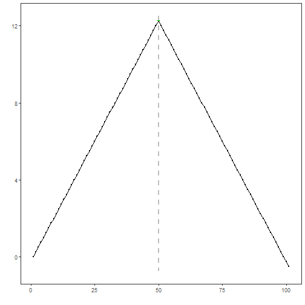

Chow tests: Chow tests for structural breaks in linear models using F-statistics over candidate breakpoints and returns estimated break locations. Harbinger wraps `strucchange` F-stats/breakpoints.

The Chow-style structural break test estimates a linear model and finds breakpoints using F statistics. In this tutorial we:

- Load and visualize a simple change-point dataset
- Configure the Chow detector (`hcp_chow`)
- Inspect detections and evaluate against labels


``` r
# Install Harbinger (if needed)
#install.packages("harbinger")
```


``` r
# Load required packages
library(daltoolbox)
library(harbinger) 
```


``` r
# Load example change-point datasets
data(examples_changepoints)
```


``` r
# Select the simple dataset
dataset <- examples_changepoints$simple
head(dataset)
```

```
##   serie event
## 1  0.00 FALSE
## 2  0.25 FALSE
## 3  0.50 FALSE
## 4  0.75 FALSE
## 5  1.00 FALSE
## 6  1.25 FALSE
```


``` r
# Plot the raw time series
har_plot(harbinger(), dataset$serie)
```


``` r
# Configure the Chow detector
model <- hcp_chow()
```


``` r
# Fit the detector (no training required)
model <- fit(model, dataset$serie)
```


``` r
# Run detection
detection <- detect(model, dataset$serie)
```


``` r
# Show detected change points
print(detection |> dplyr::filter(event == TRUE))
```

```
##   idx event        type
## 1  50  TRUE changepoint
```


``` r
# Evaluate detections against labels
evaluation <- evaluate(model, detection$event, dataset$event)
print(evaluation$confMatrix)
```

```
##           event      
## detection TRUE  FALSE
## TRUE      1     0    
## FALSE     0     100
```


``` r
# Plot detections vs. ground truth
har_plot(model, dataset$serie, detection, dataset$event)
```



References 
- Zeileis, A., Leisch, F., Kleiber, C., Hornik, K. (2002). strucchange: An R package for testing for structural change in linear regression models. Journal of Statistical Software, 7(2). doi:10.18637/jss.v007.i02
