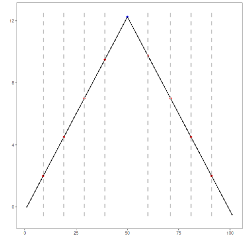

``` r
# Installing Harbinger
#install.packages"harbinger")
```


``` r
# Loading Harbinger
library(daltoolbox)
library(harbinger) 
```


``` r
# loading the example database
data(examples_changepoints)
```


``` r
# Using the simple time series 
dataset <- examples_changepoints$simple
head(dataset)
```

```
##   serie event
## 1  0.00 FALSE
## 2  0.25 FALSE
## 3  0.50 FALSE
## 4  0.75 FALSE
## 5  1.00 FALSE
## 6  1.25 FALSE
```


``` r
# ploting the time series
har_plot(harbinger(), dataset$serie)
```


``` r
# establishing change point method 
  model <- hcp_pelt()
```


``` r
# fitting the model
  model <- fit(model, dataset$serie)
```


``` r
# making detections
  detection <- detect(model, dataset$serie)
```


``` r
# filtering detected events
  print(detection |> dplyr::filter(event==TRUE))
```

```
##   idx event        type
## 1   9  TRUE changepoint
## 2  19  TRUE changepoint
## 3  29  TRUE changepoint
## 4  39  TRUE changepoint
## 5  60  TRUE changepoint
## 6  71  TRUE changepoint
## 7  81  TRUE changepoint
## 8  91  TRUE changepoint
```


``` r
# evaluating the detections
  evaluation <- evaluate(model, detection$event, dataset$event)
  print(evaluation$confMatrix)
```

```
##           event      
## detection TRUE  FALSE
## TRUE      0     8    
## FALSE     1     92
```


``` r
# plotting the results
  har_plot(model, dataset$serie, detection, dataset$event)
```



