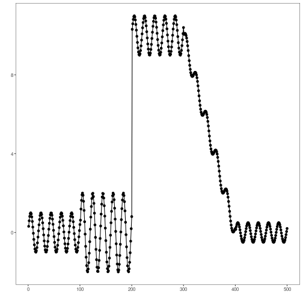
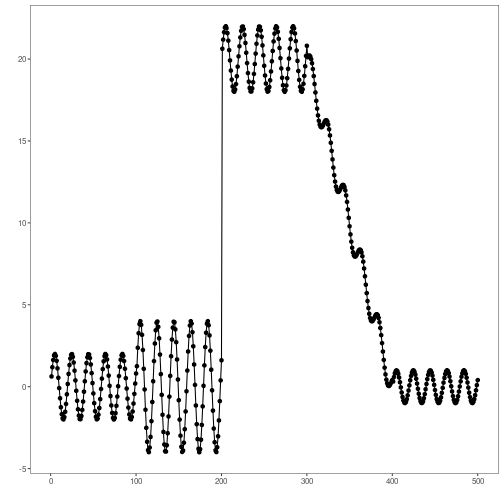
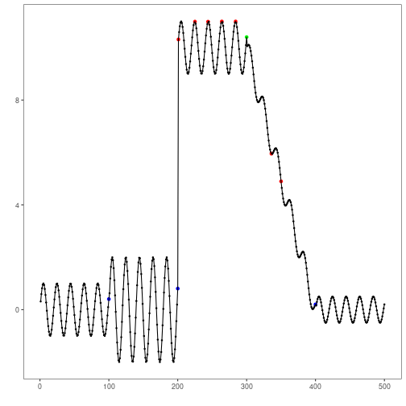

```r
# Harbinger Package
# version 1.1.707


#loading Harbinger
library(daltoolbox)
library(harbinger) 
```


```r
#Creating dataset
n <- 100  # size of each segment
serie1 <- c(sin((1:n)/pi), 2*sin((1:n)/pi), 10 + sin((1:n)/pi),
           10-10/n*(1:n)+sin((1:n)/pi)/2, sin((1:n)/pi)/2)
serie2 <- 2*c(sin((1:n)/pi), 2*sin((1:n)/pi), 10 + sin((1:n)/pi),
           10-10/n*(1:n)+sin((1:n)/pi)/2, sin((1:n)/pi)/2)
event <- rep(FALSE, length(serie1))
event[c(100, 200, 300, 400)] <- TRUE
dataset <- data.frame(serie1, serie2, event)
```


```r
#ploting the time series
plot_ts(x = 1:length(dataset$serie1), y = dataset$serie1)
```




```r
#ploting serie #2
plot_ts(x = 1:length(dataset$serie2), y = dataset$serie2)
```




```r
# establishing drift method 
model <- hcd_ddm()
```

```
## Error in hcd_ddm(): could not find function "hcd_ddm"
```


```r
# fitting the model
model <- fit(model, dataset)
```


```r
# making detections
detection <- detect(model, dataset)
```

```
## Warning in obj$anomalies[obj$non_na] <- anomalies: number of items to replace is not a multiple of replacement length
```

```
## Warning in obj$res[obj$non_na] <- res: number of items to replace is not a multiple of replacement length
```


```r
# filtering detected events
print(detection[(detection$event),])
```

```
##     idx event    type
## 201 201  TRUE anomaly
## 225 225  TRUE anomaly
## 244 244  TRUE anomaly
## 264 264  TRUE anomaly
## 284 284  TRUE anomaly
## 300 300  TRUE anomaly
## 336 336  TRUE anomaly
## 350 350  TRUE anomaly
```


```r
# evaluating the detections
  evaluation <- evaluate(model, detection$event, dataset$event)
  print(evaluation$confMatrix)
```

```
##           event      
## detection TRUE  FALSE
## TRUE      1     7    
## FALSE     3     489
```


```r
# ploting the results
  grf <- har_plot(model, dataset$serie1, detection, dataset$event)
  plot(grf)
```



