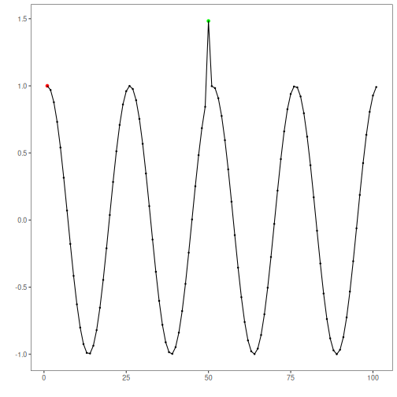

## Objective

This notebook demonstrates anomaly detection with `hanr_histogram()`. The goal is to show how a simple histogram-based density rule can flag rare observations without fitting a forecasting model.

## Method at a glance

`hanr_histogram()` builds a histogram of the observed values and labels points as anomalies when they fall into low-density bins or outside the observed bin range. It is a useful baseline because it focuses only on the empirical distribution of the series.

## What you will do

- load a labeled anomaly dataset from Harbinger
- inspect the raw series before modeling
- configure the histogram detector and run detection
- compare the detected events with the ground truth
- visualize the result with `har_plot()`


### Prepare the Example

This setup anchors the notebook in the specific series used to examine `hanr_histogram()`. The semantic point is the one stated above: `hanr_histogram()` builds a histogram of the observed values and labels points as anomalies when they fall into low-density bins or outside the observed bin range, so the raw signal needs to be visible before any fitting step hides that structure behind model output.


``` r
# Install Harbinger (if needed)
#install.packages("harbinger")
```


``` r
# Load required packages
library(daltoolbox)
library(harbinger)
```


``` r
# Load example anomaly datasets
data(examples_anomalies)
```


``` r
# Select a simple anomaly dataset
dataset <- examples_anomalies$simple
head(dataset)
```

```
##       serie event
## 1 1.0000000 FALSE
## 2 0.9689124 FALSE
## 3 0.8775826 FALSE
## 4 0.7316889 FALSE
## 5 0.5403023 FALSE
## 6 0.3153224 FALSE
```


### Interpret the Result Visually

This first visual pass establishes what the method should react to in the raw series. Keep the method summary in mind here, because `hanr_histogram()` builds a histogram of the observed values and labels points as anomalies when they fall into low-density bins or outside the observed bin range and the plot tells you whether that structure is clean, weak, local, repeated, or mixed with other effects.


``` r
# Plot the raw time series
har_plot(harbinger(), dataset$serie, event = dataset$event)
```


### Configure the Method

The choices below turn the central modeling idea into concrete parameters. They matter because `hanr_histogram()` builds a histogram of the observed values and labels points as anomalies when they fall into low-density bins or outside the observed bin range, so each argument controls how strongly the method will emphasize that pattern when it later produces anomaly flags.


``` r
# Configure the histogram-based anomaly detector
# The density threshold controls how rare a bin must be to trigger an anomaly
model <- hanr_histogram(density_threshold = 0.05)
```


``` r
# Fit is a no-op here, but keeping the same workflow is useful for comparison
model <- fit(model, dataset$serie)
```


### Run the Core Analysis

This is the moment where the notebook tests its central assumption on actual data. After applying `hanr_histogram()`, the important question is whether the resulting anomaly flags really correspond to the pattern implied by the method description above, rather than to arbitrary numerical variation.


``` r
# Run detection
detection <- detect(model, dataset$serie)
```


``` r
# Show the detected anomaly indices
print(detection |> dplyr::filter(event == TRUE))
```

```
##   idx event    type
## 1   1  TRUE anomaly
## 2  50  TRUE anomaly
```


### Evaluate What Was Found

The evaluation asks whether the anomaly flags produced by `hanr_histogram()` match the labeled structure on this dataset. Read the scores as evidence about the method's assumptions in practice, not as detached summary numbers.


``` r
# Evaluate detections against the labeled events
evaluation <- evaluate(model, detection$event, dataset$event)
print(evaluation$confMatrix)
```

```
##           event      
## detection TRUE  FALSE
## TRUE      1     1    
## FALSE     0     99
```


### Interpret the Result Visually

This visual check puts the model output back on top of the original signal. What matters now is whether the highlighted anomaly flags line up with the structure suggested by the method, which is the real semantic test of whether the example is teaching the right lesson.


``` r
# Plot detections and ground truth on the same series
har_plot(model, dataset$serie, detection, dataset$event)
```



## References

- Ogasawara, E., Salles, R., Porto, F., Pacitti, E. Event Detection in Time Series. Springer, 2025. doi:10.1007/978-3-031-75941-3
