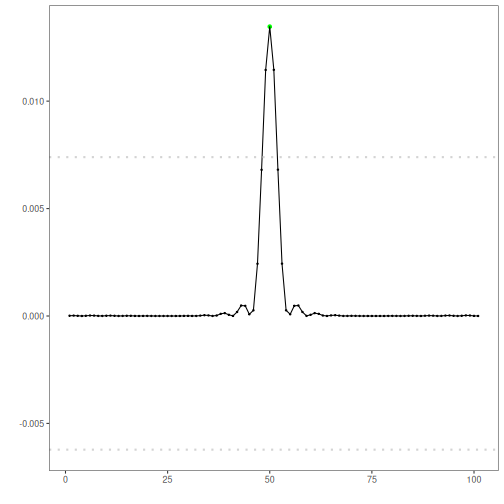

## Objective

This variant applies CUSUM to the spectrum to emphasize aggregated changes, then uses BinSeg to choose the cutoff before high-pass filtering. 

Steps:
- Load and visualize a simple anomaly dataset
- Configure and run `hanr_fft_binseg_cusum`
- Inspect detections, evaluate, and plot residual magnitudes and thresholds

## Method at a glance

FFT Binseg CUSUM regression anomaly detection: FFT-based filtering with a cutoff determined by applying CUSUM to the spectrum and locating a changepoint via Binary Segmentation. Low-frequency energy below the cutoff is removed; anomalies are flagged from residual magnitudes and thresholded with `harutils()`.

## What you will do

- understand the purpose of the example and when the technique is useful
- follow the workflow from data loading to model fitting and detection
- inspect the evaluation outputs and the diagnostic plots produced by Harbinger


### Prepare the Example

This setup anchors the notebook in the specific series used to examine `hanr_fft_binseg_cusum`. The semantic point is the one stated above: fFT Binseg CUSUM regression anomaly detection: FFT-based filtering with a cutoff determined by applying CUSUM to the spectrum and locating a changepoint via Binary Segmentation, so the raw signal needs to be visible before any fitting step hides that structure behind model output.


``` r
# Install Harbinger (if needed)
#install.packages("harbinger")
```


``` r
# Load required packages
library(daltoolbox)
library(harbinger) 
```


``` r
# Load example anomaly datasets
data(examples_anomalies)
```


``` r
# Select a simple anomaly dataset
dataset <- examples_anomalies$simple
head(dataset)
```

```
##       serie event
## 1 1.0000000 FALSE
## 2 0.9689124 FALSE
## 3 0.8775826 FALSE
## 4 0.7316889 FALSE
## 5 0.5403023 FALSE
## 6 0.3153224 FALSE
```


### Interpret the Result Visually

This first visual pass establishes what the method should react to in the raw series. Keep the method summary in mind here, because fFT Binseg CUSUM regression anomaly detection: FFT-based filtering with a cutoff determined by applying CUSUM to the spectrum and locating a changepoint via Binary Segmentation and the plot tells you whether that structure is clean, weak, local, repeated, or mixed with other effects.


``` r
# Plot the raw time series
har_plot(harbinger(), dataset$serie)
```


### Configure the Method

The choices below turn the central modeling idea into concrete parameters. They matter because fFT Binseg CUSUM regression anomaly detection: FFT-based filtering with a cutoff determined by applying CUSUM to the spectrum and locating a changepoint via Binary Segmentation, so each argument controls how strongly the method will emphasize that pattern when it later produces anomaly flags.


``` r
# Configure the FFT+CUSUM+BinSeg detector
model <- hanr_fft_binseg_cusum()
```


``` r
# Fit the detector
model <- fit(model, dataset$serie)
```


### Run the Core Analysis

This is the moment where the notebook tests its central assumption on actual data. After applying `hanr_fft_binseg_cusum`, the important question is whether the resulting anomaly flags really correspond to the pattern implied by the method description above, rather than to arbitrary numerical variation.


``` r
# Run detection
detection <- detect(model, dataset$serie)
```


``` r
# Show detected anomaly indices
print(detection |> dplyr::filter(event == TRUE))
```

```
##   idx event    type
## 1  50  TRUE anomaly
```


### Evaluate What Was Found

The evaluation asks whether the anomaly flags produced by `hanr_fft_binseg_cusum` match the labeled structure on this dataset. Read the scores as evidence about the method's assumptions in practice, not as detached summary numbers.


``` r
# Evaluate detections against labels
evaluation <- evaluate(model, detection$event, dataset$event)
print(evaluation$confMatrix)
```

```
##           event      
## detection TRUE  FALSE
## TRUE      1     0    
## FALSE     0     100
```


### Interpret the Result Visually

This visual check puts the model output back on top of the original signal. What matters now is whether the highlighted anomaly flags line up with the structure suggested by the method, which is the real semantic test of whether the example is teaching the right lesson.


``` r
# Plot detections vs. ground truth
har_plot(model, dataset$serie, detection, dataset$event)
```


``` r
# Plot residual magnitude and decision thresholds
har_plot(model, attr(detection, "res"), detection, dataset$event, yline = attr(detection, "threshold"))
```



## References

- Sobrinho, E. P., et al. Fine-Tuning Detection Criteria for Enhancing Anomaly Detection in Time Series. SBBD, 2025. doi:10.5753/sbbd.2025.247063
