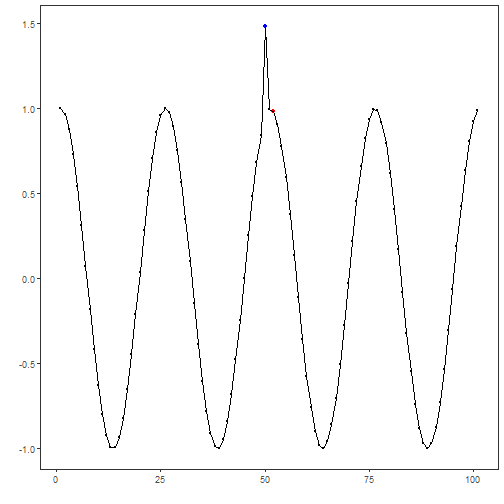
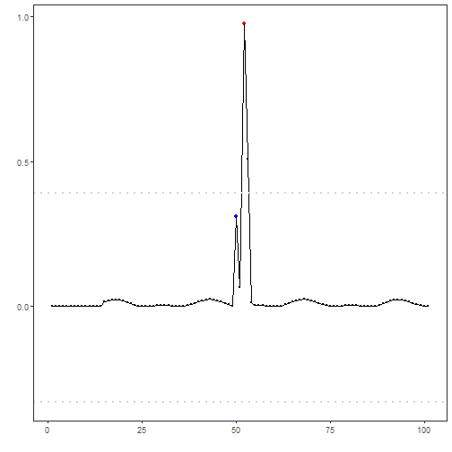

## Objective

This notebook demonstrates anomaly detection using an Extreme Learning Machine regressor (`hanr_ml + ts_elm`). The model predicts the next value and flags anomalies when residuals exceed a learned threshold. Steps: load packages/data, visualize, define and fit the model, detect, evaluate, and plot results and residuals.

## Method at a glance

ELM regression anomaly detection: Model-deviation detection using ML regression: an ELM forecaster predicts the next value from a sliding window; large prediction errors are flagged as anomalies. Implemented via DALToolbox regressors and thresholded with `harutils()`.

## What you will do

- understand the purpose of the example and when the technique is useful
- follow the workflow from data loading to model fitting and detection
- inspect the evaluation outputs and the diagnostic plots produced by Harbinger


### Prepare the Example

This setup anchors the notebook in the specific series used to examine `hanr_ml + ts_elm`. The semantic point is the one stated above: eLM regression anomaly detection: Model-deviation detection using ML regression: an ELM forecaster predicts the next value from a sliding window; large prediction errors are flagged as anomalies, so the raw signal needs to be visible before any fitting step hides that structure behind model output.


``` r
# Install Harbinger (only once, if needed)
#install.packages("harbinger")
```


``` r
# Load required packages
library(daltoolbox)
library(harbinger) 
library(tspredit)
```


``` r
# Load example datasets bundled with harbinger
data(examples_anomalies)
```


``` r
# Select a simple synthetic time series with labeled anomalies
dataset <- examples_anomalies$simple
head(dataset)
```

```
##       serie event
## 1 1.0000000 FALSE
## 2 0.9689124 FALSE
## 3 0.8775826 FALSE
## 4 0.7316889 FALSE
## 5 0.5403023 FALSE
## 6 0.3153224 FALSE
```


### Interpret the Result Visually

This first visual pass establishes what the method should react to in the raw series. Keep the method summary in mind here, because eLM regression anomaly detection: Model-deviation detection using ML regression: an ELM forecaster predicts the next value from a sliding window; large prediction errors are flagged as anomalies and the plot tells you whether that structure is clean, weak, local, repeated, or mixed with other effects.


``` r
# Plot the time series
har_plot(harbinger(), dataset$serie)
```


### Configure the Method

The choices below turn the central modeling idea into concrete parameters. They matter because eLM regression anomaly detection: Model-deviation detection using ML regression: an ELM forecaster predicts the next value from a sliding window; large prediction errors are flagged as anomalies, so each argument controls how strongly the method will emphasize that pattern when it later produces anomaly flags.


``` r
# Define ELM-based regressor for anomaly detection (hanr_ml + ts_elm)
# - input_size controls the window length; nhid/actfun tune the hidden layer
  model <- hanr_ml(ts_elm(ts_norm_gminmax(), input_size=4, nhid=3, actfun="purelin"))
```


``` r
# Fit the model
  model <- fit(model, dataset$serie)
```


### Run the Core Analysis

This is the moment where the notebook tests its central assumption on actual data. After applying `hanr_ml + ts_elm`, the important question is whether the resulting anomaly flags really correspond to the pattern implied by the method description above, rather than to arbitrary numerical variation.


``` r
# Detect anomalies (compute residuals and events)
  detection <- detect(model, dataset$serie)
```


``` r
# Show only timestamps flagged as events
  print(detection |> dplyr::filter(event==TRUE))
```

```
##   idx event    type
## 1  52  TRUE anomaly
```


### Evaluate What Was Found

The evaluation asks whether the anomaly flags produced by `hanr_ml + ts_elm` match the labeled structure on this dataset. Read the scores as evidence about the method's assumptions in practice, not as detached summary numbers.


``` r
# Evaluate detections against ground-truth labels
  evaluation <- evaluate(model, detection$event, dataset$event)
  print(evaluation$confMatrix)
```

```
##           event      
## detection TRUE  FALSE
## TRUE      0     1    
## FALSE     1     99
```


### Interpret the Result Visually

This visual check puts the model output back on top of the original signal. What matters now is whether the highlighted anomaly flags line up with the structure suggested by the method, which is the real semantic test of whether the example is teaching the right lesson.


``` r
# Plot detections over the series
  har_plot(model, dataset$serie, detection, dataset$event)
```




``` r
# Plot residual scores and threshold
  har_plot(model, attr(detection, "res"), detection, dataset$event, yline = attr(detection, "threshold"))
```



## References

- Hyndman, R. J., Athanasopoulos, G. (2021). Forecasting: Principles and Practice. OTexts.
