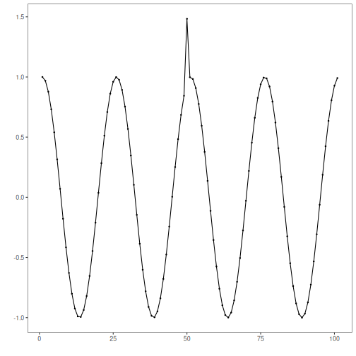
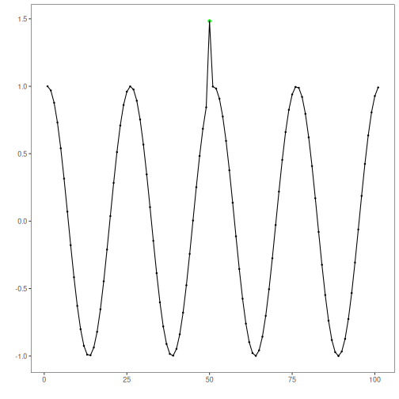
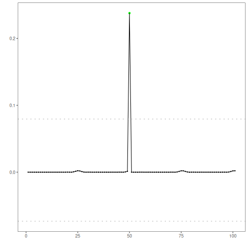

## Objective

This notebook demonstrates anomaly detection using a Multi-Layer Perceptron regressor (`hanr_ml + ts_mlp`). The model predicts the next value and flags anomalies when residuals exceed a learned threshold. Steps: load packages/data, visualize, define and fit the model, detect, evaluate, and plot results and residuals.

## Method at a glance

MLP regression anomaly detection: Model-deviation detection using ML regression: an MLP forecaster predicts the next value from a sliding window; large prediction errors are flagged as anomalies. Implemented via DALToolbox regressors and thresholded with `harutils()`.

## What you will do

- understand the purpose of the example and when the technique is useful
- follow the workflow from data loading to model fitting and detection
- inspect the evaluation outputs and the diagnostic plots produced by Harbinger

## How to read this walkthrough

The code blocks below follow the same learning rhythm used throughout the collection: prepare the environment, choose the dataset, configure the method, run the analysis, and then inspect the result. Readers who are still learning time-series mining can use that order to understand not only *what* each command does, but also *why* it appears at that stage of the workflow.

As you go through the notebook, read the inline comments inside each chunk as the operational explanation and use the surrounding prose as the conceptual guide.

## Walkthrough


``` r
# Install Harbinger (only once, if needed)
#install.packages("harbinger")
```


``` r
# Load required packages
library(daltoolbox)
library(harbinger) 
library(tspredit)
```


``` r
# Load example datasets bundled with harbinger
data(examples_anomalies)
```


``` r
# Select a simple synthetic time series with labeled anomalies
dataset <- examples_anomalies$simple
head(dataset)
```

```
##       serie event
## 1 1.0000000 FALSE
## 2 0.9689124 FALSE
## 3 0.8775826 FALSE
## 4 0.7316889 FALSE
## 5 0.5403023 FALSE
## 6 0.3153224 FALSE
```


``` r
# Plot the time series
har_plot(harbinger(), dataset$serie)
```




``` r
# Define MLP-based regressor for anomaly detection (hanr_ml + ts_mlp)
# - input_size: window length; size: hidden units; decay: weight decay
  model <- hanr_ml(ts_mlp(ts_norm_gminmax(), input_size=3, size=3, decay=0))
```


``` r
# Fit the model
  model <- fit(model, dataset$serie)
```


``` r
# Detect anomalies (compute residuals and events)
  detection <- detect(model, dataset$serie)
```


``` r
# Show only timestamps flagged as events
  print(detection |> dplyr::filter(event==TRUE))
```

```
##   idx event    type
## 1  50  TRUE anomaly
```


``` r
# Evaluate detections against ground-truth labels
  evaluation <- evaluate(model, detection$event, dataset$event)
  print(evaluation$confMatrix)
```

```
##           event      
## detection TRUE  FALSE
## TRUE      1     0    
## FALSE     0     100
```


``` r
# Plot detections over the series
  har_plot(model, dataset$serie, detection, dataset$event)
```




``` r
# Plot residual scores and threshold
  har_plot(model, attr(detection, "res"), detection, dataset$event, yline = attr(detection, "threshold"))
```



## References

- Goodfellow, I., Bengio, Y., Courville, A. (2016). Deep Learning. MIT Press.
- Hyndman, R. J., Athanasopoulos, G. (2021). Forecasting: Principles and Practice. OTexts.


