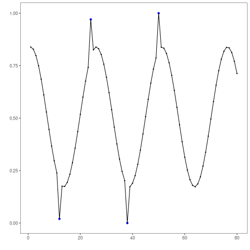
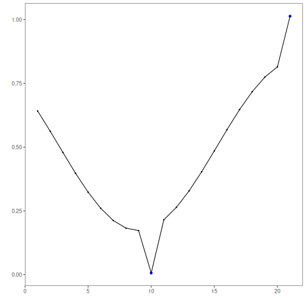
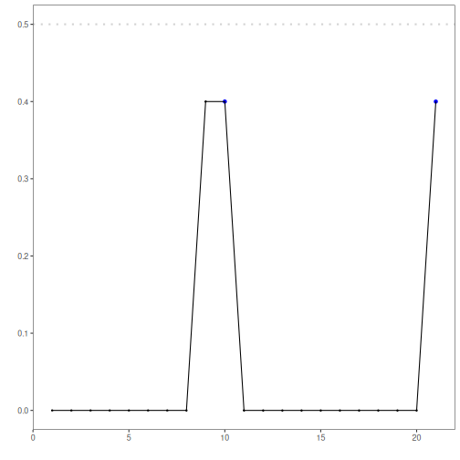

## Objective

This Rmd shows supervised anomaly classification using `hanc_ml` with a Decision Tree (`cla_dtree`). It assumes labeled events and demonstrates a simple train/test split with min-max normalization. Steps: load packages/data, visualize, preprocess (split + normalize), define and fit the classifier, detect events, evaluate, and plot results.

## Method at a glance

Decision tree classification anomaly detector: Supervised anomaly detection using a classifier trained on labeled events; predictions above a probability threshold are flagged. This example uses a decision tree via DALToolbox.

## What you will do

- understand the purpose of the example and when the technique is useful
- follow the workflow from data loading to model fitting and detection
- inspect the evaluation outputs and the diagnostic plots produced by Harbinger


### Prepare the Example

This setup anchors the notebook in the specific series used to examine `cla_dtree`. The semantic point is the one stated above: decision tree classification anomaly detector: Supervised anomaly detection using a classifier trained on labeled events; predictions above a probability threshold are flagged, so the raw signal needs to be visible before any fitting step hides that structure behind model output.


``` r
# Install Harbinger (only once, if needed)
#install.packages("harbinger")
```


``` r
# Load required packages
library(daltoolbox)
library(harbinger) 
```


``` r
# Load example datasets bundled with harbinger
data(examples_anomalies)
```


``` r
# Use the "tt" time series (labeled)
dataset <- examples_anomalies$tt

head(dataset)
```

```
##       serie event
## 1 1.0000000 FALSE
## 2 0.9689124 FALSE
## 3 0.8775826 FALSE
## 4 0.7316889 FALSE
## 5 0.5403023 FALSE
## 6 0.3153224 FALSE
```


### Interpret the Result Visually

This first visual pass establishes what the method should react to in the raw series. Keep the method summary in mind here, because decision tree classification anomaly detector: Supervised anomaly detection using a classifier trained on labeled events; predictions above a probability threshold are flagged and the plot tells you whether that structure is clean, weak, local, repeated, or mixed with other effects.


``` r
# Plot the time series
har_plot(harbinger(), dataset$serie)
```


### Configure the Method

The choices below turn the central modeling idea into concrete parameters. They matter because decision tree classification anomaly detector: Supervised anomaly detection using a classifier trained on labeled events; predictions above a probability threshold are flagged, so each argument controls how strongly the method will emphasize that pattern when it later produces event classifications.


``` r
# Data preprocessing: split and scale


train <- dataset[1:80,]
test <- dataset[-(1:80),]

norm <- minmax()
norm <- fit(norm, train)
train_n <- transform(norm, train)
summary(train_n)
```

```
##      serie          event        
##  Min.   :0.0000   Mode :logical  
##  1st Qu.:0.2859   FALSE:76       
##  Median :0.5348   TRUE :4        
##  Mean   :0.5221                  
##  3rd Qu.:0.7587                  
##  Max.   :1.0000
```


``` r
# Define Decision Tree classifier for events (hanc_ml + cla_dtree)
model <- hanc_ml(cla_dtree("event", c("FALSE", "TRUE")))
```


``` r
# Fit the model on training data
model <- fit(model, train_n)
detection <- detect(model, train_n)
print(detection |> dplyr::filter(event==TRUE))
```

```
## [1] idx   event type 
## <0 rows> (or 0-length row.names)
```

``` r
# Evaluate training performance
evaluation <- evaluate(model, detection$event, as.logical(train_n$event))
print(evaluation$confMatrix)
```

```
##           event      
## detection TRUE  FALSE
## TRUE      0     0    
## FALSE     4     76
```


### Interpret the Result Visually

This visual check puts the model output back on top of the original signal. What matters now is whether the highlighted event classifications line up with the structure suggested by the method, which is the real semantic test of whether the example is teaching the right lesson.


``` r
# Plot training detections
  har_plot(model, train_n$serie, detection, as.logical(train_n$event))
```




### Run the Core Analysis

This is the moment where the notebook tests its central assumption on actual data. After applying `cla_dtree`, the important question is whether the resulting event classifications really correspond to the pattern implied by the method description above, rather than to arbitrary numerical variation.


``` r
# Prepare test data (apply same scaler)
  test_n <- transform(norm, test)
```


``` r
# Detect and evaluate on test data
  detection <- detect(model, test_n)

  print(detection |> dplyr::filter(event==TRUE))
```

```
## [1] idx   event type 
## <0 rows> (or 0-length row.names)
```

``` r
  evaluation <- evaluate(model, detection$event, as.logical(test_n$event))
  print(evaluation$confMatrix)
```

```
##           event      
## detection TRUE  FALSE
## TRUE      0     0    
## FALSE     2     19
```


### Interpret the Result Visually

This visual check puts the model output back on top of the original signal. What matters now is whether the highlighted event classifications line up with the structure suggested by the method, which is the real semantic test of whether the example is teaching the right lesson.


``` r
# Plot test detections
  har_plot(model, test_n$serie, detection, as.logical(test_n$event))
```




``` r
# Plot residual scores and threshold
har_plot(model, attr(detection, "res"), detection, test_n$event, yline = attr(detection, "threshold"))
```



## References

- Bishop, C. M. (2006). Pattern Recognition and Machine Learning. Springer.
- Hyndman, R. J., Athanasopoulos, G. (2021). Forecasting: Principles and Practice. OTexts.
- Ogasawara, E., Salles, R., Porto, F., Pacitti, E. Event Detection in Time Series. Springer, 2025. doi:10.1007/978-3-031-75941-3
