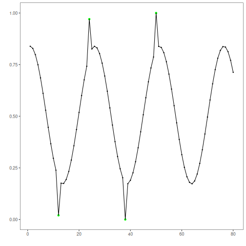
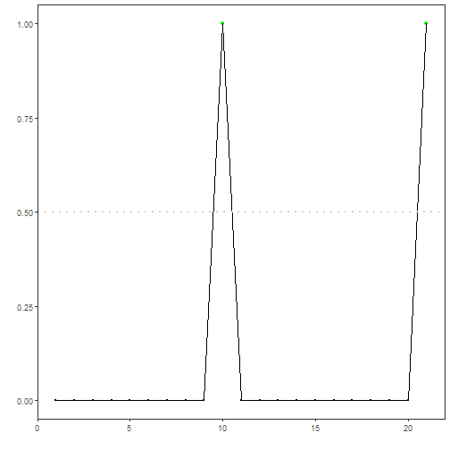

## Objective

This Rmd shows supervised anomaly classification using `hanc_ml` with k-Nearest Neighbors (`cla_knn`). It uses labeled events, a simple train/test split, and min–max normalization. Steps: load packages/data, visualize, preprocess, define and fit the classifier, detect, evaluate, and plot results.

## Method at a glance

k-NN classification anomaly detector: Supervised anomaly detection using k-NN classification on labeled data; positive-class probabilities above a threshold indicate events.

## What you will do

- understand the purpose of the example and when the technique is useful
- follow the workflow from data loading to model fitting and detection
- inspect the evaluation outputs and the diagnostic plots produced by Harbinger

## How to read this walkthrough

The code blocks below follow the same learning rhythm used throughout the collection: prepare the environment, choose the dataset, configure the method, run the analysis, and then inspect the result. Readers who are still learning time-series mining can use that order to understand not only *what* each command does, but also *why* it appears at that stage of the workflow.

As you go through the notebook, read the inline comments inside each chunk as the operational explanation and use the surrounding prose as the conceptual guide.

## Walkthrough


### Prepare the Example

We begin by organizing the environment, loading the packages, and selecting the dataset used in the notebook. This part is intentionally more direct: the goal is to make the starting point explicit before the method-specific reasoning begins.


``` r
# Install Harbinger (only once, if needed)
#install.packages("harbinger")
```


``` r
# Load required packages
library(daltoolbox)
library(harbinger) 
```


``` r
# Load example datasets bundled with harbinger
data(examples_anomalies)
```


``` r
# Use the "tt" time series (labeled)
dataset <- examples_anomalies$tt

head(dataset)
```

```
##       serie event
## 1 1.0000000 FALSE
## 2 0.9689124 FALSE
## 3 0.8775826 FALSE
## 4 0.7316889 FALSE
## 5 0.5403023 FALSE
## 6 0.3153224 FALSE
```


### Interpret the Result Visually

The final plots are not just illustrations. They help the reader connect the method's internal output with the original series, making it easier to see why a point, range, motif, or symbolic pattern was emphasized and whether that emphasis is coherent with the stated objective of the example.


``` r
# Plot the time series
har_plot(harbinger(), dataset$serie)
```


### Configure the Method

The next step is to instantiate the method and, when necessary, fit it to the selected series. This is where the notebook makes its analytical choice explicit: the parameters chosen here determine what kind of pattern the detector or transformer will become sensitive to and how the later outputs should be interpreted.


``` r
# Data preprocessing: split and scale


train <- dataset[1:80,]
test <- dataset[-(1:80),]

norm <- minmax()
norm <- fit(norm, train)
train_n <- transform(norm, train)
summary(train_n)
```

```
##      serie          event        
##  Min.   :0.0000   Mode :logical  
##  1st Qu.:0.2859   FALSE:76       
##  Median :0.5348   TRUE :4        
##  Mean   :0.5221                  
##  3rd Qu.:0.7587                  
##  Max.   :1.0000
```


``` r
# Define k-NN classifier for events (hanc_ml + cla_knn)
model <- hanc_ml(cla_knn("event", c("FALSE", "TRUE"), k=3))
```


``` r
# Fit the model on training data
model <- fit(model, train_n)
detection <- detect(model, train_n)
print(detection |> dplyr::filter(event==TRUE))
```

```
##   idx event    type
## 1  12  TRUE anomaly
## 2  24  TRUE anomaly
## 3  38  TRUE anomaly
## 4  50  TRUE anomaly
```

``` r
# Evaluate training performance
evaluation <- evaluate(model, detection$event, as.logical(train_n$event))
print(evaluation$confMatrix)
```

```
##           event      
## detection TRUE  FALSE
## TRUE      4     0    
## FALSE     0     76
```


### Interpret the Result Visually

The final plots are not just illustrations. They help the reader connect the method's internal output with the original series, making it easier to see why a point, range, motif, or symbolic pattern was emphasized and whether that emphasis is coherent with the stated objective of the example.


``` r
# Plot training detections
  har_plot(model, train_n$serie, detection, as.logical(train_n$event))
```




### Run the Core Analysis

With the environment and the method ready, we execute the central analytical step and inspect its immediate output. This is the point where the abstract idea described earlier becomes operational, so the reader should pay attention to what is produced and how Harbinger standardizes the result.


``` r
# Prepare test data (apply same scaler)
  test_n <- transform(norm, test)
```


``` r
# Detect and evaluate on test data
  detection <- detect(model, test_n)

  print(detection |> dplyr::filter(event==TRUE))
```

```
##   idx event    type
## 1  10  TRUE anomaly
## 2  21  TRUE anomaly
```

``` r
  evaluation <- evaluate(model, detection$event, as.logical(test_n$event))
  print(evaluation$confMatrix)
```

```
##           event      
## detection TRUE  FALSE
## TRUE      2     0    
## FALSE     0     19
```


### Interpret the Result Visually

The final plots are not just illustrations. They help the reader connect the method's internal output with the original series, making it easier to see why a point, range, motif, or symbolic pattern was emphasized and whether that emphasis is coherent with the stated objective of the example.


``` r
# Plot test detections
  har_plot(model, test_n$serie, detection, as.logical(test_n$event))
```


``` r
# Plot residual scores and threshold
har_plot(model, attr(detection, "res"), detection, test_n$event, yline = attr(detection, "threshold"))
```



## References

- Bishop, C. M. (2006). Pattern Recognition and Machine Learning. Springer.
- Hyndman, R. J., Athanasopoulos, G. (2021). Forecasting: Principles and Practice. OTexts.
- Ogasawara, E., Salles, R., Porto, F., Pacitti, E. Event Detection in Time Series. Springer, 2025. doi:10.1007/978-3-031-75941-3
