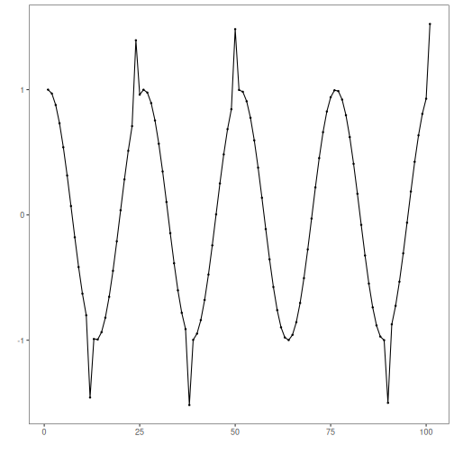
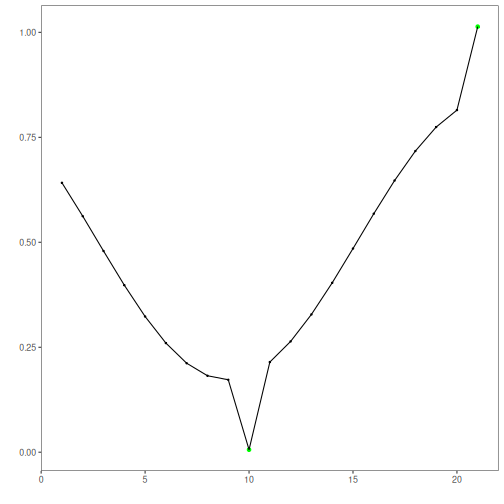
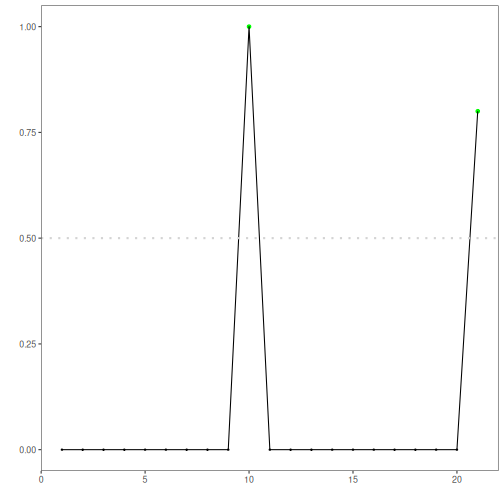

## Objective

This tutorial shows supervised anomaly detection with a Random Forest classifier on a labeled train/test split. 

Steps:
- Load and visualize the dataset
- Normalize, train RF, evaluate on train and test
- Plot detections and residual magnitudes

## Method at a glance

Random Forest classification anomaly detection: Supervised anomaly detection with a Random Forest classifier trained on labeled events; predicted probabilities above a threshold are flagged.

## What you will do

- understand the purpose of the example and when the technique is useful
- follow the workflow from data loading to model fitting and detection
- inspect the evaluation outputs and the diagnostic plots produced by Harbinger


### Prepare the Example

This setup anchors the notebook in the specific series used to examine `25-classification-hanc_ml_rf`. The semantic point is the one stated above: random Forest classification anomaly detection: Supervised anomaly detection with a Random Forest classifier trained on labeled events; predicted probabilities above a threshold are flagged, so the raw signal needs to be visible before any fitting step hides that structure behind model output.


``` r
# Install Harbinger (if needed)
#install.packages("harbinger")
```


``` r
# Load required packages
library(daltoolbox)
library(harbinger) 
```


``` r
# Load example anomaly datasets
data(examples_anomalies)
```


``` r
# Select the train/test dataset
dataset <- examples_anomalies$tt

head(dataset)
```

```
##       serie event
## 1 1.0000000 FALSE
## 2 0.9689124 FALSE
## 3 0.8775826 FALSE
## 4 0.7316889 FALSE
## 5 0.5403023 FALSE
## 6 0.3153224 FALSE
```


### Interpret the Result Visually

This first visual pass establishes what the method should react to in the raw series. Keep the method summary in mind here, because random Forest classification anomaly detection: Supervised anomaly detection with a Random Forest classifier trained on labeled events; predicted probabilities above a threshold are flagged and the plot tells you whether that structure is clean, weak, local, repeated, or mixed with other effects.


``` r
# Plot the raw time series
har_plot(harbinger(), dataset$serie)
```




### Configure the Method

The choices below turn the central modeling idea into concrete parameters. They matter because random Forest classification anomaly detection: Supervised anomaly detection with a Random Forest classifier trained on labeled events; predicted probabilities above a threshold are flagged, so each argument controls how strongly the method will emphasize that pattern when it later produces event classifications.


``` r
# Split into train/test and normalize features
train <- dataset[1:80,]
test <- dataset[-(1:80),]

norm <- minmax()
norm <- fit(norm, train)
train_n <- transform(norm, train)
summary(train_n)
```

```
##      serie          event        
##  Min.   :0.0000   Mode :logical  
##  1st Qu.:0.2859   FALSE:76       
##  Median :0.5348   TRUE :4        
##  Mean   :0.5221                  
##  3rd Qu.:0.7587                  
##  Max.   :1.0000
```


``` r
# Configure RF classifier
model <- hanc_ml(cla_rf("event", c("FALSE", "TRUE"), mtry = 1, ntree = 5))
```


``` r
# Fit on training data and evaluate on train
model <- fit(model, train_n)
detection <- detect(model, train_n)
print(detection |> dplyr::filter(event == TRUE))
```

```
##   idx event    type
## 1  12  TRUE anomaly
## 2  24  TRUE anomaly
## 3  38  TRUE anomaly
## 4  50  TRUE anomaly
```

``` r
evaluation <- evaluate(model, detection$event, as.logical(train_n$event))
print(evaluation$confMatrix)
```

```
##           event      
## detection TRUE  FALSE
## TRUE      4     0    
## FALSE     0     76
```


### Interpret the Result Visually

This visual check puts the model output back on top of the original signal. What matters now is whether the highlighted event classifications line up with the structure suggested by the method, which is the real semantic test of whether the example is teaching the right lesson.


``` r
# Plot training detections
har_plot(model, train_n$serie, detection, as.logical(train_n$event))
```


### Run the Core Analysis

This is the moment where the notebook tests its central assumption on actual data. After applying `25-classification-hanc_ml_rf`, the important question is whether the resulting event classifications really correspond to the pattern implied by the method description above, rather than to arbitrary numerical variation.


``` r
# Prepare normalized test set
test_n <- transform(norm, test)
```


``` r
# Detect and evaluate on test
detection <- detect(model, test_n)
print(detection |> dplyr::filter(event == TRUE))
```

```
##   idx event    type
## 1  10  TRUE anomaly
## 2  21  TRUE anomaly
```

``` r
evaluation <- evaluate(model, detection$event, as.logical(test_n$event))
print(evaluation$confMatrix)
```

```
##           event      
## detection TRUE  FALSE
## TRUE      2     0    
## FALSE     0     19
```


### Interpret the Result Visually

This visual check puts the model output back on top of the original signal. What matters now is whether the highlighted event classifications line up with the structure suggested by the method, which is the real semantic test of whether the example is teaching the right lesson.


``` r
# Plot test detections
har_plot(model, test_n$serie, detection, as.logical(test_n$event))
```




``` r
# Plot residual magnitude and decision threshold
har_plot(model, attr(detection, "res"), detection, test_n$event, yline = attr(detection, "threshold"))
```



## References

- Bishop, C. M. (2006). Pattern Recognition and Machine Learning. Springer.
