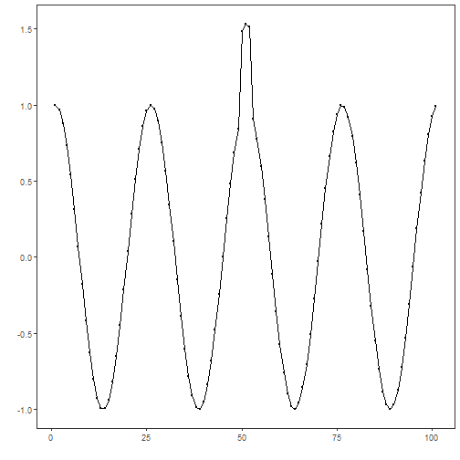
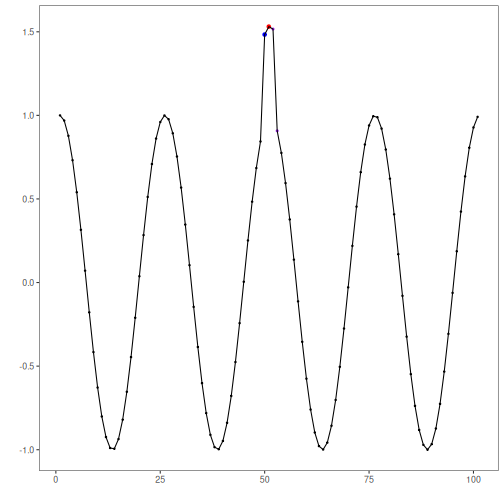
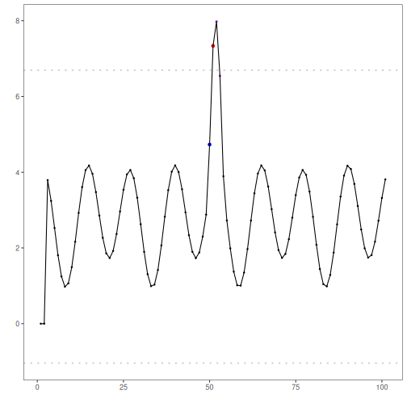

## Objective

This notebook demonstrates discord (rare pattern) discovery using k-means via `hanct_kmeans(k)`. The model clusters subsequences and identifies discords that are far from any cluster centroid. Steps: load packages/data, visualize, define k-means model, fit, detect, evaluate, and plot series and residuals.

## Method at a glance

K-means clustering discord anomaly detection: K-means clustering over sliding-window subsequences; windows far from their nearest centroid are flagged as discords. Summaries and thresholds use `harutils()`.

## What you will do

- understand the purpose of the example and when the technique is useful
- follow the workflow from data loading to model fitting and detection
- inspect the evaluation outputs and the diagnostic plots produced by Harbinger


### Prepare the Example

This setup anchors the notebook in the specific series used to examine `hanct_kmeans(k)`. The semantic point is the one stated above: k-means clustering discord anomaly detection: K-means clustering over sliding-window subsequences; windows far from their nearest centroid are flagged as discords, so the raw signal needs to be visible before any fitting step hides that structure behind model output.


``` r
# Install Harbinger (only once, if needed)
#install.packages("harbinger")
```


``` r
# Load required packages
library(daltoolbox)
library(harbinger) 
```


``` r
# Load example datasets bundled with harbinger
data(examples_anomalies)
```


``` r
# Use the sequence time series (labeled)
dataset <- examples_anomalies$sequence
head(dataset)
```

```
##       serie event
## 1 1.0000000 FALSE
## 2 0.9689124 FALSE
## 3 0.8775826 FALSE
## 4 0.7316889 FALSE
## 5 0.5403023 FALSE
## 6 0.3153224 FALSE
```


### Interpret the Result Visually

This first visual pass establishes what the method should react to in the raw series. Keep the method summary in mind here, because k-means clustering discord anomaly detection: K-means clustering over sliding-window subsequences; windows far from their nearest centroid are flagged as discords and the plot tells you whether that structure is clean, weak, local, repeated, or mixed with other effects.


``` r
# Plot the time series
har_plot(harbinger(), dataset$serie)
```




### Configure the Method

The choices below turn the central modeling idea into concrete parameters. They matter because k-means clustering discord anomaly detection: K-means clustering over sliding-window subsequences; windows far from their nearest centroid are flagged as discords, so each argument controls how strongly the method will emphasize that pattern when it later produces cluster-based anomaly flags.


``` r
# Define k-means discord detector (k controls number of clusters)
  model <- hanct_kmeans(3)
```


``` r
# Fit the model
  model <- fit(model, dataset$serie)
```


### Run the Core Analysis

This is the moment where the notebook tests its central assumption on actual data. After applying `hanct_kmeans(k)`, the important question is whether the resulting cluster-based anomaly flags really correspond to the pattern implied by the method description above, rather than to arbitrary numerical variation.


``` r
# Detect discords using k-means distances
  detection <- detect(model, dataset$serie)
```


``` r
# Show only timestamps flagged as events
  print(detection |> dplyr::filter(event==TRUE))
```

```
##   idx event    type seq seqlen
## 1  51  TRUE discord   3      3
```


### Evaluate What Was Found

The evaluation asks whether the cluster-based anomaly flags produced by `hanct_kmeans(k)` match the labeled structure on this dataset. Read the scores as evidence about the method's assumptions in practice, not as detached summary numbers.


``` r
# Evaluate detections against ground-truth labels
  evaluation <- evaluate(model, detection$event, dataset$event)
  print(evaluation$confMatrix)
```

```
##           event      
## detection TRUE  FALSE
## TRUE      0     1    
## FALSE     1     99
```


### Interpret the Result Visually

This visual check puts the model output back on top of the original signal. What matters now is whether the highlighted cluster-based anomaly flags line up with the structure suggested by the method, which is the real semantic test of whether the example is teaching the right lesson.


``` r
# Plot detections over the series
  har_plot(model, dataset$serie, detection, dataset$event)
```




``` r
# Plot residual scores and threshold
  har_plot(model, attr(detection, "res"), detection, dataset$event, yline = attr(detection, "threshold"))
```



## References

- Ogasawara, E., Salles, R., Porto, F., Pacitti, E. Event Detection in Time Series. Springer, 2025. doi:10.1007/978-3-031-75941-3
