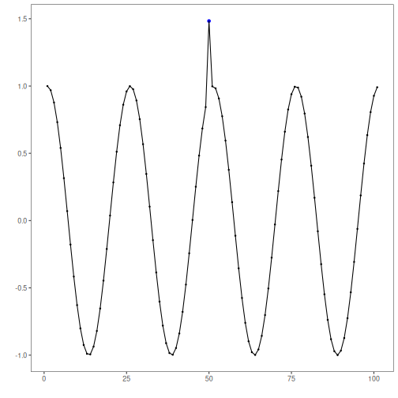
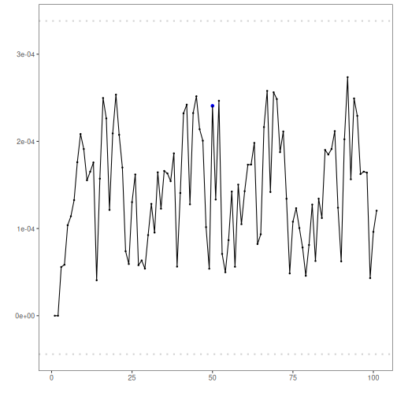

## Objective

This notebook demonstrates anomaly detection with a stacked autoencoder (`han_autoencoder(..., autoenc_stacked_ed, ...)`). Stacking deepens the encoder/decoder to capture richer structure; anomalies have higher reconstruction error. Steps: load packages/data, visualize, define layers/epochs, fit, detect, evaluate, and plot.

## Method at a glance

Stacked autoencoder (encode-decode): A stacked autoencoder deepens encoder/decoder layers to capture richer nonlinear structure; large reconstruction error flags anomalies. Detection thresholds use `harutils()`.

## What you will do

- understand the purpose of the example and when the technique is useful
- follow the workflow from data loading to model fitting and detection
- inspect the evaluation outputs and the diagnostic plots produced by Harbinger

## How to read this walkthrough

The code blocks below follow the same learning rhythm used throughout the collection: prepare the environment, choose the dataset, configure the method, run the analysis, and then inspect the result. Readers who are still learning time-series mining can use that order to understand not only *what* each command does, but also *why* it appears at that stage of the workflow.

As you go through the notebook, read the inline comments inside each chunk as the operational explanation and use the surrounding prose as the conceptual guide.

## Walkthrough


``` r
# Load required packages
library(daltoolbox)
library(harbinger) 
library(daltoolboxdp)
```


``` r
# Load example datasets bundled with harbinger
data(examples_anomalies)
```


``` r
# Select a simple synthetic time series with labeled anomalies
dataset <- examples_anomalies$simple
head(dataset)
```

```
##       serie event
## 1 1.0000000 FALSE
## 2 0.9689124 FALSE
## 3 0.8775826 FALSE
## 4 0.7316889 FALSE
## 5 0.5403023 FALSE
## 6 0.3153224 FALSE
```


``` r
# Plot the time series
har_plot(harbinger(), dataset$serie)
```


``` r
# Define stacked autoencoder-based detector (autoenc_stacked_ed)
  model <- han_autoencoder(3, 2, autoenc_stacked_ed, num_epochs = 1500)
```


``` r
# Fit the model
  model <- fit(model, dataset$serie)
```


``` r
# Detect anomalies (reconstruction error -> events)
  detection <- detect(model, dataset$serie)
```


``` r
# Show only timestamps flagged as events
  print(detection |> dplyr::filter(event==TRUE))
```

```
## [1] idx   event type 
## <0 rows> (or 0-length row.names)
```


``` r
# Evaluate detections against ground-truth labels
  evaluation <- evaluate(model, detection$event, dataset$event)
  print(evaluation$confMatrix)
```

```
##           event      
## detection TRUE  FALSE
## TRUE      0     0    
## FALSE     1     100
```


``` r
# Plot detections over the series
  har_plot(model, dataset$serie, detection, dataset$event)
```



``` r
# Plot residual scores and threshold
  har_plot(model, attr(detection, "res"), detection, dataset$event, yline = attr(detection, "threshold"))
```



## References

- Sakurada, M., Yairi, T. (2014). Anomaly Detection Using Autoencoders with Nonlinear Dimensionality Reduction. MLSDA 2014.


