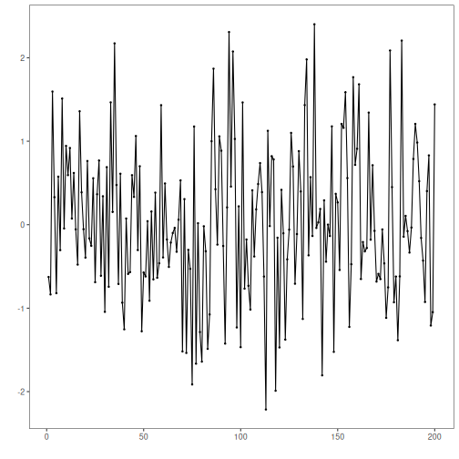
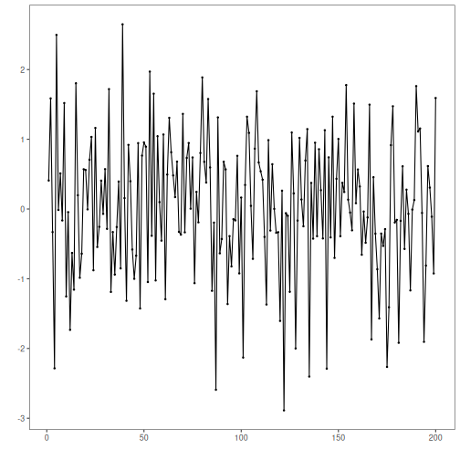
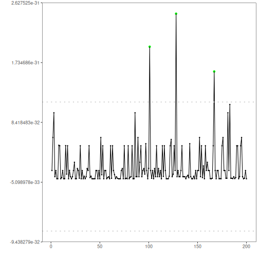

## Objective

The PCA-based detector flags large reconstruction errors when projecting multivariate data onto principal components. In this tutorial we:

- Load a multivariate example and create synthetic event labels
- Fit the PCA detector on two dimensions
- Visualize detections over different series and inspect residual magnitudes

## Method at a glance

PCA-based regression anomaly detection: Projects multivariate observations onto principal components and reconstructs data; large reconstruction errors indicate anomalies. Data are standardized, PCA is fitted, and reconstruction errors are thresholded.

## What you will do

- understand the purpose of the example and when the technique is useful
- follow the workflow from data loading to model fitting and detection
- inspect the evaluation outputs and the diagnostic plots produced by Harbinger

## How to read this walkthrough

The code blocks below follow the same learning rhythm used throughout the collection: prepare the environment, choose the dataset, configure the method, run the analysis, and then inspect the result. Readers who are still learning time-series mining can use that order to understand not only *what* each command does, but also *why* it appears at that stage of the workflow.

As you go through the notebook, read the inline comments inside each chunk as the operational explanation and use the surrounding prose as the conceptual guide.

## Walkthrough


``` r
# Install Harbinger (if needed)
#install.packages("harbinger")
```


``` r
# Load required packages
library(daltoolbox)
library(harbinger) 
library(ggplot2)
```


``` r
# Load a multivariate example and define event labels (for demo)
data("examples_harbinger")
dataset <- examples_harbinger$multidimensional
dataset$event <- FALSE
dataset$event[c(101,128,167)] <- TRUE
```


``` r
head(dataset)
```

```
##        serie           x event
## 1 -0.6264538  0.40940184 FALSE
## 2 -0.8356286  1.58658843 FALSE
## 3  1.5952808 -0.33090780 FALSE
## 4  0.3295078 -2.28523554 FALSE
## 5 -0.8204684  2.49766159 FALSE
## 6  0.5757814 -0.01339952 FALSE
```


``` r
# Plot the target series
har_plot(harbinger(), dataset$serie)
```




``` r
# Plot the second dimension
har_plot(harbinger(), dataset$x)
```




``` r
# Fit the PCA detector on the first two columns and run detection
model <- fit(hmu_pca(), dataset[,1:2])
detection <- detect(model, dataset[,1:2])
```


``` r
# Plot detections on the target series
grf <- har_plot(model, dataset$serie, detection, dataset$event)
grf <- grf + ylab("serie")
```


``` r
# Plot detections on the second dimension
grf <- har_plot(model, dataset$x, detection, dataset$event)
grf <- grf + ylab("x")
```


``` r
# Plot residual magnitude and decision thresholds
har_plot(model, attr(detection, "res"), detection, dataset$event, yline = attr(detection, "threshold"))
```



## References

- Jolliffe, I. T. (2002). Principal Component Analysis. Springer.


