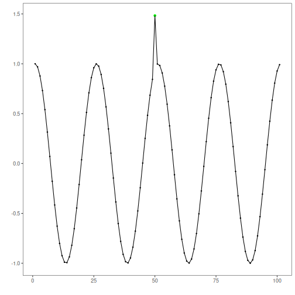
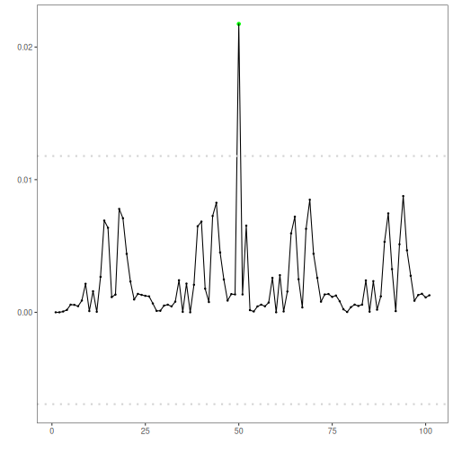

## Objective

This notebook demonstrates anomaly detection with a stacked autoencoder (`han_autoencoder(..., autoenc_stacked_ed, ...)`). Stacking deepens the encoder/decoder to capture richer structure; anomalies have higher reconstruction error. Steps: load packages/data, visualize, define layers/epochs, fit, detect, evaluate, and plot.

## Method at a glance

Stacked autoencoder (encode-decode): A stacked autoencoder deepens encoder/decoder layers to capture richer nonlinear structure; large reconstruction error flags anomalies. Detection thresholds use `harutils()`.

## What you will do

- understand the purpose of the example and when the technique is useful
- follow the workflow from data loading to model fitting and detection
- inspect the evaluation outputs and the diagnostic plots produced by Harbinger


### Prepare the Example

This setup anchors the notebook in the specific series used to examine `han_autoencoder(..., autoenc_stacked_ed, ...)`. The semantic point is the one stated above: stacked autoencoder (encode-decode): A stacked autoencoder deepens encoder/decoder layers to capture richer nonlinear structure; large reconstruction error flags anomalies, so the raw signal needs to be visible before any fitting step hides that structure behind model output.


``` r
source(url("https://raw.githubusercontent.com/cefet-rj-dal/harbinger/main/examples/seed.R"))
```

```
## Warning in readLines(file, warn = FALSE): cannot open URL
## 'https://raw.githubusercontent.com/cefet-rj-dal/harbinger/main/examples/seed.R': HTTP status was '404 Not Found'
```

```
## Error in `readLines()`:
## ! cannot open the connection to 'https://raw.githubusercontent.com/cefet-rj-dal/harbinger/main/examples/seed.R'
```

``` r
# Load required packages
library(daltoolbox)
library(harbinger) 
library(daltoolboxdp)
```


``` r
# Load example datasets bundled with harbinger
data(examples_anomalies)
```


``` r
# Select a simple synthetic time series with labeled anomalies
dataset <- examples_anomalies$simple
head(dataset)
```

```
##       serie event
## 1 1.0000000 FALSE
## 2 0.9689124 FALSE
## 3 0.8775826 FALSE
## 4 0.7316889 FALSE
## 5 0.5403023 FALSE
## 6 0.3153224 FALSE
```


### Interpret the Result Visually

This first visual pass establishes what the method should react to in the raw series. Keep the method summary in mind here, because stacked autoencoder (encode-decode): A stacked autoencoder deepens encoder/decoder layers to capture richer nonlinear structure; large reconstruction error flags anomalies and the plot tells you whether that structure is clean, weak, local, repeated, or mixed with other effects.


``` r
# Plot the time series
har_plot(harbinger(), dataset$serie)
```


### Configure the Method

The choices below turn the central modeling idea into concrete parameters. They matter because stacked autoencoder (encode-decode): A stacked autoencoder deepens encoder/decoder layers to capture richer nonlinear structure; large reconstruction error flags anomalies, so each argument controls how strongly the method will emphasize that pattern when it later produces reconstruction-based anomaly flags.


``` r
# Define stacked autoencoder-based detector (autoenc_stacked_ed)
  model <- han_autoencoder(3, 2, autoenc_stacked_ed, epochs = 100)
```


``` r
# Fit the model
set_example_seed()
```

```
## Error in `set_example_seed()`:
## ! could not find function "set_example_seed"
```

``` r
  model <- fit(model, dataset$serie)
```


### Run the Core Analysis

This is the moment where the notebook tests its central assumption on actual data. After applying `han_autoencoder(..., autoenc_stacked_ed, ...)`, the important question is whether the resulting reconstruction-based anomaly flags really correspond to the pattern implied by the method description above, rather than to arbitrary numerical variation.


``` r
# Detect anomalies (reconstruction error -> events)
  detection <- detect(model, dataset$serie)
```


``` r
# Show only timestamps flagged as events
  print(detection |> dplyr::filter(event==TRUE))
```

```
##   idx event    type
## 1  50  TRUE anomaly
```


### Evaluate What Was Found

The evaluation asks whether the reconstruction-based anomaly flags produced by `han_autoencoder(..., autoenc_stacked_ed, ...)` match the labeled structure on this dataset. Read the scores as evidence about the method's assumptions in practice, not as detached summary numbers.


``` r
# Evaluate detections against ground-truth labels
  evaluation <- evaluate(model, detection$event, dataset$event)
  print(evaluation$confMatrix)
```

```
##           event      
## detection TRUE  FALSE
## TRUE      1     0    
## FALSE     0     100
```


### Interpret the Result Visually

This visual check puts the model output back on top of the original signal. What matters now is whether the highlighted reconstruction-based anomaly flags line up with the structure suggested by the method, which is the real semantic test of whether the example is teaching the right lesson.


``` r
# Plot detections over the series
  har_plot(model, dataset$serie, detection, dataset$event)
```




``` r
# Plot residual scores and threshold
  har_plot(model, attr(detection, "res"), detection, dataset$event, yline = attr(detection, "threshold"))
```



## References

- Sakurada, M., Yairi, T. (2014). Anomaly Detection Using Autoencoders with Nonlinear Dimensionality Reduction. MLSDA 2014.


