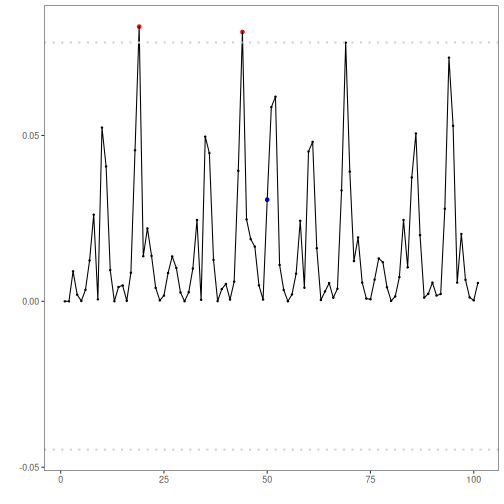

Adversarial Autoencoder (encode-decode): An adversarial autoencoder (AAE) augments a standard encoder–decoder with an adversarial objective on the latent code. The encoder maps each input window into a latent vector and the decoder attempts to reconstruct the original window. In parallel, a discriminator is trained to distinguish latent samples produced by the encoder from samples drawn from a chosen prior distribution (e.g., Gaussian). The encoder is trained to fool the discriminator, aligning the aggregated posterior of the latent space with the prior. This regularization encourages the model to represent normal time-series patterns on a compact manifold and to reconstruct them well. Windows that deviate from this learned manifold (anomalies) typically yield larger reconstruction errors. In this example, windows are scored by reconstruction error and events are flagged when the score exceeds a learned threshold.

Objectives: 
This Rmd demonstrates anomaly detection with an adversarial autoencoder (`han_autoencoder(..., autoenc_adv_ed, ...)`). The model learns a robust latent representation; anomalies yield higher reconstruction error. Steps: load packages/data, visualize, define the architecture/epochs, fit, detect, evaluate, and plot.


``` r
# Install Harbinger (only once, if needed)
#install.packages("harbinger")
```


``` r
# Load required packages
library(daltoolbox)
```

```
## 
## Attaching package: 'daltoolbox'
```

```
## The following object is masked from 'package:base':
## 
##     transform
```

``` r
library(daltoolboxdp)
```

```
## Registered S3 method overwritten by 'quantmod':
##   method            from
##   as.zoo.data.frame zoo
```

```
## Registered S3 methods overwritten by 'forecast':
##   method  from 
##   head.ts stats
##   tail.ts stats
```

``` r
library(harbinger) 
```


``` r
# Load example datasets bundled with harbinger
data(examples_anomalies)
```


``` r
# Select a simple synthetic time series with labeled anomalies
dataset <- examples_anomalies$simple
head(dataset)
```

```
##       serie event
## 1 1.0000000 FALSE
## 2 0.9689124 FALSE
## 3 0.8775826 FALSE
## 4 0.7316889 FALSE
## 5 0.5403023 FALSE
## 6 0.3153224 FALSE
```


``` r
# Plot the time series
har_plot(harbinger(), dataset$serie)
```


``` r
# Define adversarial autoencoder-based detector (autoenc_adv_ed)
  model <- han_autoencoder(3, 2, autoenc_adv_ed, num_epochs = 1500)
```


``` r
# Fit the model
  model <- fit(model, dataset$serie)
```


``` r
# Detect anomalies (reconstruction error -> events)
  detection <- detect(model, dataset$serie)
```


``` r
# Show only timestamps flagged as events
  print(detection |> dplyr::filter(event==TRUE))
```

```
##   idx event    type
## 1  19  TRUE anomaly
## 2  44  TRUE anomaly
## 3  69  TRUE anomaly
```


``` r
# Evaluate detections against ground-truth labels
  evaluation <- evaluate(model, detection$event, dataset$event)
  print(evaluation$confMatrix)
```

```
##           event      
## detection TRUE  FALSE
## TRUE      0     3    
## FALSE     1     97
```


``` r
# Plot detections over the series
  har_plot(model, dataset$serie, detection, dataset$event)
```


``` r
# Plot residual scores and threshold
  har_plot(model, attr(detection, "res"), detection, dataset$event, yline = attr(detection, "threshold"))
```

```
## Warning: Using `size` aesthetic for lines was deprecated in ggplot2 3.4.0.
## ℹ Please use `linewidth` instead.
## ℹ The deprecated feature was likely used in the harbinger package.
##   Please report the issue at <https://github.com/cefet-rj-dal/harbinger/issues>.
## This warning is displayed once every 8 hours.
## Call `lifecycle::last_lifecycle_warnings()` to see where this warning was generated.
```



References:
- Makhzani, A., Shlens, J., Jaitly, N., Goodfellow, I., & Frey, B. (2016). Adversarial Autoencoders. arXiv:1511.05644.
- Chalapathy, R., & Chawla, S. (2019). Deep Learning for Anomaly Detection: A Survey. arXiv:1901.03407.
