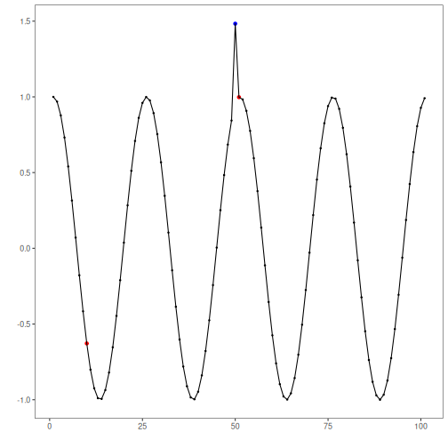
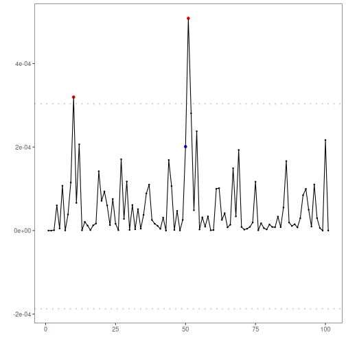

variational autoencoder (VAE) (encode-decode): A variational autoencoder (VAE) learns a probabilistic latent space and reconstructs windows; high reconstruction error (and uncertainty) signals anomalies. Errors are summarized and thresholded using `harutils()`.

Objectives: This Rmd demonstrates anomaly detection with a variational autoencoder (`han_autoencoder(..., autoenc_variational_ed, ...)`). The VAE learns a probabilistic latent space; reconstruction error (and uncertainty) can indicate anomalies. Steps: load packages/data, visualize, define the architecture/epochs, fit, detect, evaluate, and plot.


``` r
# Load required packages
library(daltoolbox)
library(harbinger) 
library(daltoolboxdp)
```


``` r
# Load example datasets bundled with harbinger
data(examples_anomalies)
```


``` r
# Select a simple synthetic time series with labeled anomalies
dataset <- examples_anomalies$simple
head(dataset)
```

```
##       serie event
## 1 1.0000000 FALSE
## 2 0.9689124 FALSE
## 3 0.8775826 FALSE
## 4 0.7316889 FALSE
## 5 0.5403023 FALSE
## 6 0.3153224 FALSE
```


``` r
# Plot the time series
har_plot(harbinger(), dataset$serie)
```


``` r
# Define variational autoencoder-based detector (autoenc_variational_ed)
  model <- han_autoencoder(3, 2, autoenc_variational_ed, num_epochs = 1500)
```


``` r
# Fit the model
  model <- fit(model, dataset$serie)
```


``` r
# Detect anomalies (reconstruction error -> events)
  detection <- detect(model, dataset$serie)
```


``` r
# Show only timestamps flagged as events
  print(detection |> dplyr::filter(event==TRUE))
```

```
##   idx event    type
## 1  22  TRUE anomaly
## 2  47  TRUE anomaly
## 3  83  TRUE anomaly
```


``` r
# Evaluate detections against ground-truth labels
  evaluation <- evaluate(model, detection$event, dataset$event)
  print(evaluation$confMatrix)
```

```
##           event      
## detection TRUE  FALSE
## TRUE      0     3    
## FALSE     1     97
```


``` r
# Plot detections over the series
  har_plot(model, dataset$serie, detection, dataset$event)
```




``` r
# Plot residual scores and threshold
  har_plot(model, attr(detection, "res"), detection, dataset$event, yline = attr(detection, "threshold"))
```




References 
- Sakurada, M., Yairi, T. (2014). Anomaly Detection Using Autoencoders with Nonlinear Dimensionality Reduction. MLSDA 2014.
