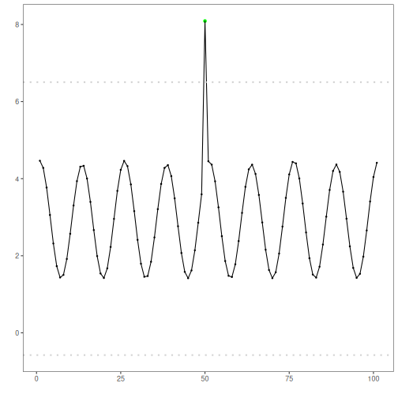

DTW-based clustering anomaly detector: This approach applies Dynamic Time Warping (DTW) within a clustering framework. For `seq = 1`, each observation is assigned to the nearest centroid under DTW; observations with large DTW distance from their closest centroid are flagged as point anomalies. For `seq > 1`, sliding-window subsequences are compared and large-distance windows are flagged as discords. The implementation wraps DTW-based clustering from `dtwclust` and uses `harutils()` for summarization and thresholding.

DTW-based clustering detects anomalies by measuring distance to cluster centroids over sliding windows (seq=1 flags point anomalies). 

Steps:
- Load and visualize a simple anomaly dataset
- Configure and run `hanct_dtw(seq = 1)`
- Inspect detections, evaluate, and plot residual magnitudes and thresholds


``` r
# Install Harbinger (if needed)
#install.packages("harbinger")
```


``` r
# Load required packages
library(daltoolbox)
library(harbinger) 
```


``` r
# Load example anomaly datasets
data(examples_anomalies)
```


``` r
# Select a simple anomaly dataset
dataset <- examples_anomalies$simple
head(dataset)
```

```
##       serie event
## 1 1.0000000 FALSE
## 2 0.9689124 FALSE
## 3 0.8775826 FALSE
## 4 0.7316889 FALSE
## 5 0.5403023 FALSE
## 6 0.3153224 FALSE
```


``` r
# Plot the raw time series
har_plot(harbinger(), dataset$serie)
```


``` r
# Configure DTW-clustering for point anomalies (seq = 1)
model <- hanct_dtw(1)
```


``` r
# Fit the detector
model <- fit(model, dataset$serie)
```

```
## Found more than one class "dist" in cache; using the first, from namespace 'dtwclust'
```

```
## Also defined by 'spam'
```


``` r
# Run detection
detection <- detect(model, dataset$serie)
```


``` r
# Show detected anomaly indices
print(detection |> dplyr::filter(event == TRUE))
```

```
##   idx event    type
## 1  50  TRUE anomaly
```


``` r
# Evaluate detections against labels
evaluation <- evaluate(model, detection$event, dataset$event)
print(evaluation$confMatrix)
```

```
##           event      
## detection TRUE  FALSE
## TRUE      1     0    
## FALSE     0     100
```


``` r
# Plot detections vs. ground truth
har_plot(model, dataset$serie, detection, dataset$event)
```


``` r
# Plot residual magnitude and decision thresholds
har_plot(model, attr(detection, "res"), detection, dataset$event, yline = attr(detection, "threshold"))
```



References 
- Ogasawara, E., Salles, R., Porto, F., Pacitti, E. Event Detection in Time Series. 1st ed. Cham: Springer Nature Switzerland, 2025. doi:10.1007/978-3-031-75941-3
