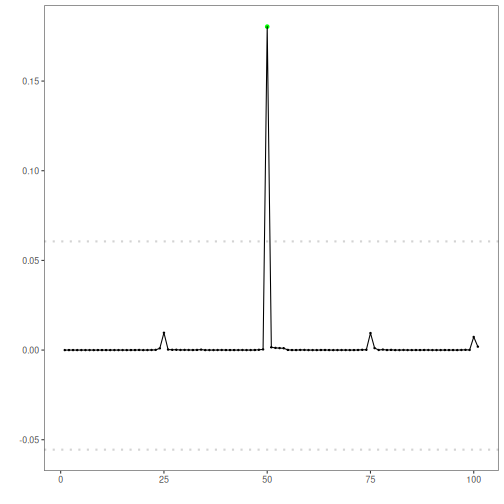

Conv1d regression anomaly detection: Model-deviation detection using ML regression: a Conv1D forecaster predicts the next value from a sliding window; large prediction errors are flagged as anomalies. Implemented via DALToolbox regressors and thresholded with `harutils()`.

Objectives: This Rmd demonstrates anomaly detection using a 1D Convolutional regressor (`hanr_ml + ts_conv1d`). The model predicts the next value using convolutional filters; anomalies are flagged when residuals exceed a learned threshold. Steps: load packages/data, visualize, define and fit the model, detect, evaluate, and plot results and residuals.


``` r
# Install Harbinger (only once, if needed)
#install.packages("harbinger")
```


``` r
# Load required packages
library(daltoolbox)
library(harbinger) 
library(tspredit)
library(daltoolboxdp)
```


``` r
# Load example datasets bundled with harbinger
data(examples_anomalies)
```


``` r
# Select a simple synthetic time series with labeled anomalies
dataset <- examples_anomalies$simple
head(dataset)
```

```
##       serie event
## 1 1.0000000 FALSE
## 2 0.9689124 FALSE
## 3 0.8775826 FALSE
## 4 0.7316889 FALSE
## 5 0.5403023 FALSE
## 6 0.3153224 FALSE
```


``` r
# Plot the time series
har_plot(harbinger(), dataset$serie)
```


``` r
# Define Conv1D-based regressor (hanr_ml + ts_conv1d)
# - input_size: window length; epochs: training iterations
  model <- hanr_ml(ts_conv1d(ts_norm_gminmax(), input_size=4, epochs=10000))
```


``` r
# Fit the model
  model <- fit(model, dataset$serie)
```


``` r
# Detect anomalies (compute residuals and events)
  detection <- detect(model, dataset$serie)
```


``` r
# Show only timestamps flagged as events
  print(detection |> dplyr::filter(event==TRUE))
```

```
##   idx event    type
## 1  50  TRUE anomaly
```


``` r
# Evaluate detections against ground-truth labels
  evaluation <- evaluate(model, detection$event, dataset$event)
  print(evaluation$confMatrix)
```

```
##           event      
## detection TRUE  FALSE
## TRUE      1     0    
## FALSE     0     100
```


``` r
# Plot detections over the series
  har_plot(model, dataset$serie, detection, dataset$event)
```


``` r
# Plot residual scores and threshold
  har_plot(model, attr(detection, "res"), detection, dataset$event, yline = attr(detection, "threshold"))
```



References 
- Goodfellow, I., Bengio, Y., Courville, A. (2016). Deep Learning. MIT Press.
- Hyndman, R. J., Athanasopoulos, G. (2021). Forecasting: Principles and Practice. OTexts.
