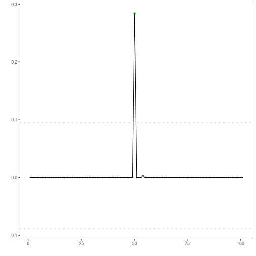

SVM regression anomaly detection: Model-deviation detection using ML regression: an SVM forecaster predicts the next value from a sliding window; large prediction errors are flagged as anomalies. Implemented via DALToolbox regressors and thresholded with `harutils()`.

Objectives: This Rmd demonstrates anomaly detection in a univariate time series using a Support Vector Machine regressor via harbinger's `hanr_ml + ts_svm`. The model learns short-range dynamics to predict the next value; large residuals are flagged as anomalies using an adaptive threshold. The workflow is: load packages and data, visualize the series, define and fit the model, run detection, evaluate, and plot results (including residual scores).


``` r
# Install Harbinger (only once, if needed)
#install.packages("harbinger")
```


``` r
# Load required packages
library(daltoolbox)
library(harbinger) 
library(tspredit)
```


``` r
# Load example datasets bundled with harbinger
data(examples_anomalies)
```


``` r
# Select a simple synthetic time series with labeled anomalies
dataset <- examples_anomalies$simple
head(dataset)
```

```
##       serie event
## 1 1.0000000 FALSE
## 2 0.9689124 FALSE
## 3 0.8775826 FALSE
## 4 0.7316889 FALSE
## 5 0.5403023 FALSE
## 6 0.3153224 FALSE
```


``` r
# Plot the time series
har_plot(harbinger(), dataset$serie)
```


``` r
# Define SVM-based regressor for anomaly detection (hanr_ml + ts_svm)
# - input_size=4 sets the window length used for prediction
# - kernel="radial" uses the RBF kernel; tune if needed
  model <- hanr_ml(ts_svm(ts_norm_gminmax(), input_size=4,  kernel = "radial"))
```


``` r
# Fit the model
  model <- fit(model, dataset$serie)
```


``` r
# Detect anomalies (compute residuals and events)
  detection <- detect(model, dataset$serie)
```


``` r
# Show only timestamps flagged as events
  print(detection |> dplyr::filter(event==TRUE))
```

```
##   idx event    type
## 1  50  TRUE anomaly
```


``` r
# Evaluate detections against ground-truth labels
  evaluation <- evaluate(model, detection$event, dataset$event)
  print(evaluation$confMatrix)
```

```
##           event      
## detection TRUE  FALSE
## TRUE      1     0    
## FALSE     0     100
```


``` r
# Plot detections over the series
  har_plot(model, dataset$serie, detection, dataset$event)
```


``` r
# Plot residual scores and threshold
  har_plot(model, attr(detection, "res"), detection, dataset$event, yline = attr(detection, "threshold"))
```



References 
- Hyndman, R. J., Athanasopoulos, G. (2021). Forecasting: Principles and Practice. OTexts.
