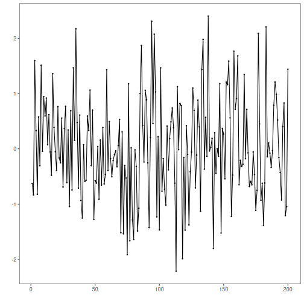
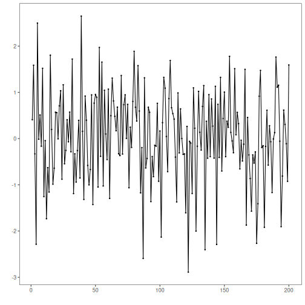
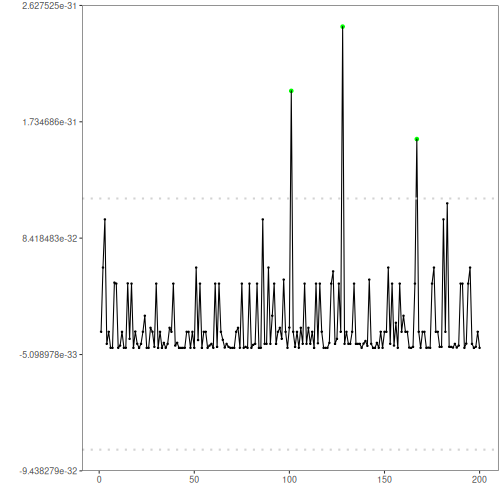

PCA-based regression anomaly detection: Projects multivariate observations onto principal components and reconstructs data; large reconstruction errors indicate anomalies. Data are standardized, PCA is fitted, and reconstruction errors are thresholded.

The PCA-based detector flags large reconstruction errors when projecting multivariate data onto principal components. In this tutorial we:

- Load a multivariate example and create synthetic event labels
- Fit the PCA detector on two dimensions
- Visualize detections over different series and inspect residual magnitudes


``` r
# Install Harbinger (if needed)
#install.packages("harbinger")
```


``` r
# Load required packages
library(daltoolbox)
library(harbinger) 
library(ggplot2)
```


``` r
# Load a multivariate example and define event labels (for demo)
data("examples_harbinger")
dataset <- examples_harbinger$multidimensional
dataset$event <- FALSE
dataset$event[c(101,128,167)] <- TRUE
```


``` r
head(dataset)
```

```
##        serie           x event
## 1 -0.6264538  0.40940184 FALSE
## 2 -0.8356286  1.58658843 FALSE
## 3  1.5952808 -0.33090780 FALSE
## 4  0.3295078 -2.28523554 FALSE
## 5 -0.8204684  2.49766159 FALSE
## 6  0.5757814 -0.01339952 FALSE
```


``` r
# Plot the target series
har_plot(harbinger(), dataset$serie)
```




``` r
# Plot the second dimension
har_plot(harbinger(), dataset$x)
```




``` r
# Fit the PCA detector on the first two columns and run detection
model <- fit(hmu_pca(), dataset[,1:2])
detection <- detect(model, dataset[,1:2])
```


``` r
# Plot detections on the target series
grf <- har_plot(model, dataset$serie, detection, dataset$event)
grf <- grf + ylab("serie")
```


``` r
# Plot detections on the second dimension
grf <- har_plot(model, dataset$x, detection, dataset$event)
grf <- grf + ylab("x")
```


``` r
# Plot residual magnitude and decision thresholds
har_plot(model, attr(detection, "res"), detection, dataset$event, yline = attr(detection, "threshold"))
```



References 
- Jolliffe, I. T. (2002). Principal Component Analysis. Springer.
