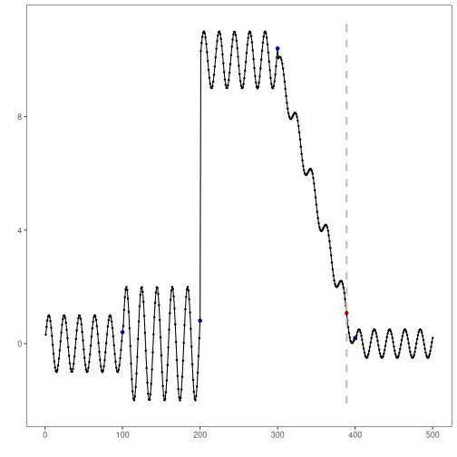

## Objective

AMOC (At Most One Change) detects a single, most significant change point in a univariate time series. In this tutorial we will:

- Load a synthetic dataset with ground-truth change points
- Visualize the series
- Configure and run the AMOC detector (`hcp_amoc`)
- Inspect detections and evaluate against ground truth
- Plot the detections over the series

## Method at a glance

AMOC: AMOC targets a single most significant change point in a univariate series by optimizing a cost function over all possible change locations. It is appropriate when at most one structural break is expected. This wraps the AMOC method from the `changepoint` package.

## What you will do

- understand the purpose of the example and when the technique is useful
- follow the workflow from data loading to model fitting and detection
- inspect the evaluation outputs and the diagnostic plots produced by Harbinger

## How to read this walkthrough

The code blocks below follow the same learning rhythm used throughout the collection: prepare the environment, choose the dataset, configure the method, run the analysis, and then inspect the result. Readers who are still learning time-series mining can use that order to understand not only *what* each command does, but also *why* it appears at that stage of the workflow.

As you go through the notebook, read the inline comments inside each chunk as the operational explanation and use the surrounding prose as the conceptual guide.

## Walkthrough


``` r
# Install Harbinger (if needed)
#install.packages("harbinger")
```


``` r
# Load required packages
library(daltoolbox)
library(harbinger) 
```


``` r
# Load example change-point datasets
data(examples_changepoints)
```


``` r
# Select a dataset ("complex" contains multiple regimes)
dataset <- examples_changepoints$complex
head(dataset)
```

```
##       serie event
## 1 0.3129618 FALSE
## 2 0.5944808 FALSE
## 3 0.8162731 FALSE
## 4 0.9560557 FALSE
## 5 0.9997847 FALSE
## 6 0.9430667 FALSE
```


``` r
# Plot the time series to visualize regime changes
har_plot(harbinger(), dataset$serie)
```


``` r
# Configure the AMOC change-point detector (single change)
model <- hcp_amoc()
```


``` r
# Fit the detector (no training required, keeps parameters on object)
model <- fit(model, dataset$serie)
```


``` r
# Run detection over the full series
detection <- detect(model, dataset$serie)
```


``` r
# Show detected change-point indices
print(detection |> dplyr::filter(event == TRUE))
```

```
##   idx event        type
## 1 389  TRUE changepoint
```


``` r
# Evaluate detections against the labeled events
evaluation <- evaluate(model, detection$event, dataset$event)
print(evaluation$confMatrix)
```

```
##           event      
## detection TRUE  FALSE
## TRUE      0     1    
## FALSE     4     495
```


``` r
# Plot detections and ground truth on top of the series
har_plot(model, dataset$serie, detection, dataset$event)
```



## References

- Hinkley, D. V. (1970). Inference about the change-point in a sequence of random variables. Biometrika, 57(1), 1–17. doi:10.1093/biomet/57.1.1
- Killick, R., Fearnhead, P., Eckley, I. A. (2012). Optimal detection of changepoints with a linear computational cost. Journal of the American Statistical Association, 107(500), 1590–1598.


