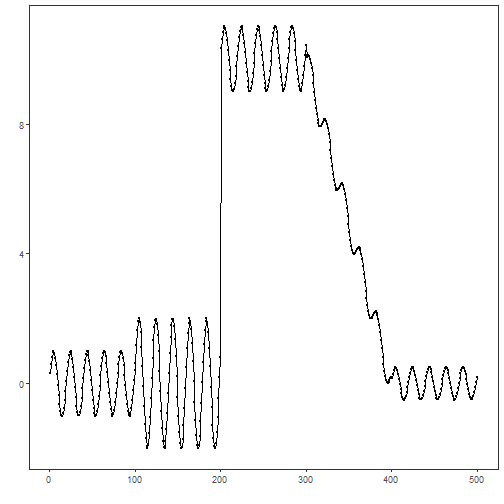
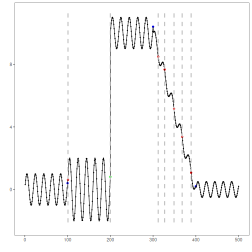

## Objective

Binary Segmentation (BinSeg) recursively identifies multiple change points by splitting the series at the strongest change and repeating. In this tutorial we will:

- Load a dataset with change points and visualize it
- Configure and run the BinSeg detector (`hcp_binseg`)
- Inspect detections and evaluate against ground truth
- Plot the detections on the series

## Method at a glance

BinSeg: Binary Segmentation recursively partitions the series around the largest detected change until a maximum number of change points or a stopping criterion is met. It is a fast heuristic widely used in practice. Harbinger wraps the `changepoint` implementation and returns detected indices with plotting and evaluation utilities.

## What you will do

- understand the purpose of the example and when the technique is useful
- follow the workflow from data loading to model fitting and detection
- inspect the evaluation outputs and the diagnostic plots produced by Harbinger

## How to read this walkthrough

The code blocks below follow the same learning rhythm used throughout the collection: prepare the environment, choose the dataset, configure the method, run the analysis, and then inspect the result. Readers who are still learning time-series mining can use that order to understand not only *what* each command does, but also *why* it appears at that stage of the workflow.

As you go through the notebook, read the inline comments inside each chunk as the operational explanation and use the surrounding prose as the conceptual guide.

## Walkthrough


### Prepare the Example

We begin by organizing the environment, loading the packages, and selecting the dataset used in the notebook. This part is intentionally more direct: the goal is to make the starting point explicit before the method-specific reasoning begins.


``` r
# Install Harbinger (if needed)
#install.packages("harbinger")
```


``` r
# Load required packages
library(daltoolbox)
library(harbinger) 
```


``` r
# Load example change-point datasets
data(examples_changepoints)
```


``` r
# Select a dataset ("complex" contains multiple regimes)
dataset <- examples_changepoints$complex
head(dataset)
```

```
##       serie event
## 1 0.3129618 FALSE
## 2 0.5944808 FALSE
## 3 0.8162731 FALSE
## 4 0.9560557 FALSE
## 5 0.9997847 FALSE
## 6 0.9430667 FALSE
```


### Interpret the Result Visually

The final plots are not just illustrations. They help the reader connect the method's internal output with the original series, making it easier to see why a point, range, motif, or symbolic pattern was emphasized and whether that emphasis is coherent with the stated objective of the example.


``` r
# Plot the time series to visualize regimes
har_plot(harbinger(), dataset$serie)
```




### Configure the Method

The next step is to instantiate the method and, when necessary, fit it to the selected series. This is where the notebook makes its analytical choice explicit: the parameters chosen here determine what kind of pattern the detector or transformer will become sensitive to and how the later outputs should be interpreted.


``` r
# Configure BinSeg; Q is the max number of change points to search
model <- hcp_binseg(Q = 10)
```


``` r
# Fit the detector (keeps parameters on object)
model <- fit(model, dataset$serie)
```


### Run the Core Analysis

With the environment and the method ready, we execute the central analytical step and inspect its immediate output. This is the point where the abstract idea described earlier becomes operational, so the reader should pay attention to what is produced and how Harbinger standardizes the result.


``` r
# Run detection over the series
detection <- detect(model, dataset$serie)
```


``` r
# Show detected change-point indices
print(detection |> dplyr::filter(event == TRUE))
```

```
##   idx event        type
## 1 101  TRUE changepoint
## 2 200  TRUE changepoint
## 3 312  TRUE changepoint
## 4 327  TRUE changepoint
## 5 349  TRUE changepoint
## 6 368  TRUE changepoint
## 7 389  TRUE changepoint
```


### Evaluate What Was Found

After producing detections or transformed outputs, we compare them with the reference labels whenever they are available. This stage matters because it connects the visual intuition of the method with an explicit measurement of quality, helping the learner understand not only whether the method runs, but how well it behaves.


``` r
# Evaluate detections against labeled events
evaluation <- evaluate(model, detection$event, dataset$event)
print(evaluation$confMatrix)
```

```
##           event      
## detection TRUE  FALSE
## TRUE      1     6    
## FALSE     3     490
```


### Interpret the Result Visually

The final plots are not just illustrations. They help the reader connect the method's internal output with the original series, making it easier to see why a point, range, motif, or symbolic pattern was emphasized and whether that emphasis is coherent with the stated objective of the example.


``` r
# Plot detections and ground truth
har_plot(model, dataset$serie, detection, dataset$event)
```



## References

- Vostrikova, L. (1981). Detecting “disorder” in multidimensional random processes. Soviet Mathematics Doklady, 24, 55–59.
- Killick, R., Fearnhead, P., Eckley, I. A. (2012). Optimal detection of changepoints with a linear computational cost. Journal of the American Statistical Association, 107(500), 1590–1598.
