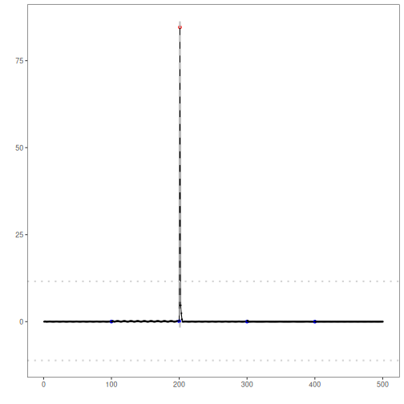

## Objective

ChangeFinder-ARIMA detects change points by modeling residual deviations and smoothing them over a sliding window. In this tutorial we will:

- Load and visualize a simple change-point dataset
- Configure the ChangeFinder-ARIMA detector with a window size
- Inspect detections, evaluate, and plot residuals with thresholds

## Method at a glance

ChangeFinder with ARIMA: ChangeFinder with ARIMA models residual deviations and applies a second-stage smoothing/thresholding to highlight structural changes. Implementation wraps ARIMA from `forecast` and uses `harutils()` for thresholds.

## What you will do

- understand the purpose of the example and when the technique is useful
- follow the workflow from data loading to model fitting and detection
- inspect the evaluation outputs and the diagnostic plots produced by Harbinger


### Prepare the Example

This setup anchors the notebook in the specific series used to examine `harutils()`. The semantic point is the one stated above: changeFinder with ARIMA: ChangeFinder with ARIMA models residual deviations and applies a second-stage smoothing/thresholding to highlight structural changes, so the raw signal needs to be visible before any fitting step hides that structure behind model output.


``` r
# Install Harbinger (if needed)
#install.packages("harbinger")
```


``` r
# Load required packages
library(daltoolbox)
library(harbinger) 
```


``` r
# Load example change-point datasets
data(examples_changepoints)
```


``` r
# Select the simple dataset
dataset <- examples_changepoints$simple
head(dataset)
```

```
##   serie event
## 1  0.00 FALSE
## 2  0.25 FALSE
## 3  0.50 FALSE
## 4  0.75 FALSE
## 5  1.00 FALSE
## 6  1.25 FALSE
```


### Interpret the Result Visually

This first visual pass establishes what the method should react to in the raw series. Keep the method summary in mind here, because changeFinder with ARIMA: ChangeFinder with ARIMA models residual deviations and applies a second-stage smoothing/thresholding to highlight structural changes and the plot tells you whether that structure is clean, weak, local, repeated, or mixed with other effects.


``` r
# Plot the raw time series
har_plot(harbinger(), dataset$serie)
```


### Configure the Method

The choices below turn the central modeling idea into concrete parameters. They matter because changeFinder with ARIMA: ChangeFinder with ARIMA models residual deviations and applies a second-stage smoothing/thresholding to highlight structural changes, so each argument controls how strongly the method will emphasize that pattern when it later produces change-point candidates.


``` r
# Configure ChangeFinder-ARIMA (sw_size controls smoothing window)
model <- hcp_cf_arima(sw_size = 10)
```


``` r
# Fit the detector
model <- fit(model, dataset$serie)
```


### Run the Core Analysis

This is the moment where the notebook tests its central assumption on actual data. After applying `harutils()`, the important question is whether the resulting change-point candidates really correspond to the pattern implied by the method description above, rather than to arbitrary numerical variation.


``` r
# Run detection
detection <- detect(model, dataset$serie)
```


``` r
# Show detected change points
print(detection |> dplyr::filter(event == TRUE))
```

```
##   idx event    type
## 1  51  TRUE anomaly
```


### Evaluate What Was Found

The evaluation asks whether the change-point candidates produced by `harutils()` match the labeled structure on this dataset. Read the scores as evidence about the method's assumptions in practice, not as detached summary numbers.


``` r
# Evaluate detections against labels
evaluation <- evaluate(model, detection$event, dataset$event)
print(evaluation$confMatrix)
```

```
##           event      
## detection TRUE  FALSE
## TRUE      0     1    
## FALSE     1     99
```


### Interpret the Result Visually

This visual check puts the model output back on top of the original signal. What matters now is whether the highlighted change-point candidates line up with the structure suggested by the method, which is the real semantic test of whether the example is teaching the right lesson.


``` r
# Plot detections vs. ground truth
har_plot(model, dataset$serie, detection, dataset$event)
```


``` r
# Plot residual magnitude and decision thresholds
har_plot(model, attr(detection, "res"), detection, dataset$event, yline = attr(detection, "threshold"))
```



## References

- Takeuchi, J., Yamanishi, K. (2006). A unifying framework for detecting outliers and change points from time series. IEEE TKDE. doi:10.1109/TKDE.2006.1599387
