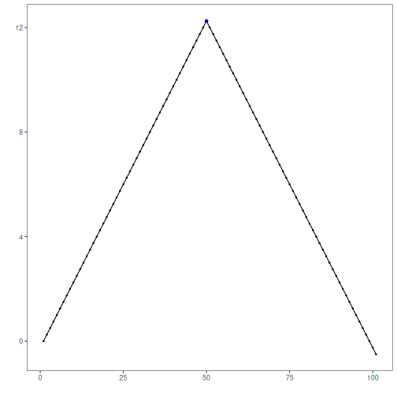
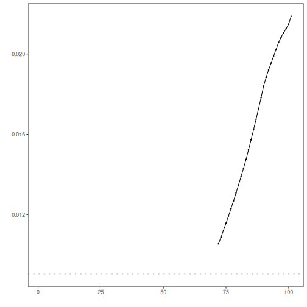

## Objective

Waypoint combines an autoencoder with a bilateral CUSUM supervisor to detect
regime changes. This first notebook establishes the baseline experiment with a
plain feed-forward autoencoder. The experimental line used here will be kept in
the next Waypoint notebooks: same dataset, same detector parameters, same
evaluation workflow, and only the encoder architecture changes.

- Load and visualize a simple change-point dataset
- Configure `hcp_waypoint()` with the baseline feed-forward autoencoder
- Inspect detected change points, evaluate them, and plot reconstruction error
  against the learned decision level

## Method at a glance

Waypoint: an autoencoder learns the current regime from sliding windows, the
window reconstruction error is standardized on a recent buffer, and a bilateral
CUSUM validates persistent deviations. After confirmation, the model is
retrained on the new regime.

## Experimental line

This notebook is the baseline of the architecture comparison:

- `11`: feed-forward autoencoder, the generic reference point
- `12`: LSTM autoencoder, emphasizing temporal order inside the window
- `13`: convolutional autoencoder, emphasizing local patterns inside the window

Because the rest of the configuration is fixed, differences in detections
should be read mainly as consequences of the encoder bias.

## What you will do

- understand the baseline Waypoint configuration
- follow the workflow from data loading to fitting and detection
- inspect the evaluation outputs and the diagnostic plots produced by Harbinger
- use this notebook as the reference point for the LSTM and convolutional
  variants

### Prepare the Example

This setup anchors the notebook in the specific series used to examine
`hcp_waypoint()`. The raw signal is shown first because Waypoint is supposed to
flag regime changes, not isolated spikes, so the series context matters before
the reconstruction model and the CUSUM supervisor are applied.


``` r
# Install Harbinger and DALToolboxDP (if needed)
# install.packages("harbinger")
# install.packages("daltoolboxdp")
```


``` r
# Load required packages
library(daltoolbox)
library(daltoolboxdp)
library(harbinger)
```


``` r
# Load example change-point datasets
data(examples_changepoints)
```


``` r
# Select the simple dataset
dataset <- examples_changepoints$simple
head(dataset)
```

```
##   serie event
## 1  0.00 FALSE
## 2  0.25 FALSE
## 3  0.50 FALSE
## 4  0.75 FALSE
## 5  1.00 FALSE
## 6  1.25 FALSE
```

### Interpret the Result Visually

This first visual pass shows the regime structure the detector should recover.
The baseline feed-forward autoencoder does not impose a strong temporal bias on
the window representation, so this notebook acts as the neutral reference for
the later architecture variants.


``` r
# Plot the raw time series
har_plot(harbinger(), dataset$serie)
```


### Configure the Method

The parameter line below will be reused in the next Waypoint notebooks. The key
experimental choice here is `encoderclass = autoenc_ed`, which provides the
plain feed-forward baseline. The other arguments control window length, warm-up,
retraining behavior, and the bilateral CUSUM thresholds.


``` r
# Configure Waypoint with a feed-forward autoencoder
model <- hcp_waypoint(
  input_size = 12,
  encode_size = 4,
  warmup = 60,
  retrain_size = 30,
  buffer_size = 40,
  k_factor = 0.35,
  h_low = 3.5,
  h_high = 6,
  prob_tau = 0.997,
  epochs_init = 100,
  epochs_retrain = 100,
  encoderclass = autoenc_ed
)
```


``` r
# Fit the detector
model <- fit(model, dataset$serie)
```

### Run the Core Analysis

This is the baseline Waypoint experiment. The important question is whether the
reconstruction error generated by the feed-forward autoencoder is stable within
regimes and large enough at the regime transition for the CUSUM supervisor to
confirm the change.


``` r
# Run detection
detection <- detect(model, dataset$serie)
```

```
## Warning in obj$res[obj$non_na] <- res: number of items to replace is not a multiple of replacement length
```


``` r
# Show detected change points
print(detection |> dplyr::filter(event == TRUE))
```

```
## [1] idx   event type 
## <0 rows> (or 0-length row.names)
```

### Evaluate What Was Found

The evaluation checks whether the detected change points agree with the labels.
Because this notebook is the baseline of the architecture comparison, these
scores are the reference for judging whether the LSTM and convolutional
encoders improve or worsen the experimental line.


``` r
# Evaluate detections against labels
evaluation <- evaluate(model, detection$event, dataset$event)
print(evaluation$confMatrix)
```

```
##           event      
## detection TRUE  FALSE
## TRUE      0     0    
## FALSE     1     100
```

### Interpret the Result Visually

This plot places the detections back on the original signal. What matters here
is whether the confirmed change points align with the actual regime transition
instead of reacting to local noise.


``` r
# Plot detections vs. ground truth
har_plot(model, dataset$serie, detection, dataset$event)
```




``` r
# Plot reconstruction error and the learned decision level
har_plot(model, attr(detection, "res"), detection, dataset$event, yline = attr(detection, "tau"))
```

```
## Warning: Removed 71 rows containing missing values or values outside the scale range (`geom_point()`).
```

```
## Warning: Removed 71 rows containing missing values or values outside the scale range (`geom_line()`).
```



## References

- Ogasawara, E., Salles, R., Porto, F., Pacitti, E. Event Detection in Time
  Series. Springer, 2025. doi:10.1007/978-3-031-75941-3
