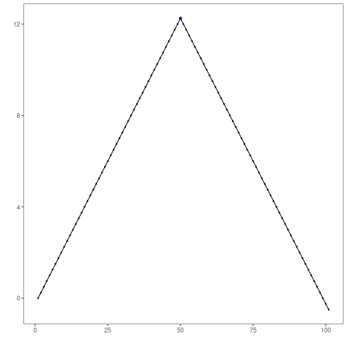
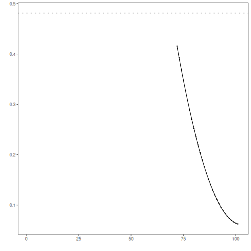

## Objective

Waypoint combines an autoencoder with a bilateral CUSUM supervisor to detect
regime changes. This notebook keeps the same experimental line as the baseline
Waypoint example and changes only the encoder architecture to an LSTM
autoencoder.

- Load and visualize the same simple change-point dataset used in the baseline
- Configure `hcp_waypoint()` with an LSTM autoencoder
- Inspect detected change points, evaluate them, and compare the diagnostic
  plots against the baseline logic

## Method at a glance

Waypoint: an autoencoder learns the current regime from sliding windows, the
window reconstruction error is standardized on a recent buffer, and a bilateral
CUSUM validates persistent deviations. After confirmation, the model is
retrained on the new regime.

## Experimental line

This notebook is the second point in the architecture comparison:

- `11`: feed-forward autoencoder, generic baseline
- `12`: LSTM autoencoder, sequential bias inside the window
- `13`: convolutional autoencoder, local-pattern bias inside the window

Only the encoder architecture changes here. The remaining detector parameters
are intentionally fixed so the comparison stays interpretable.

## What you will do

- reproduce the Waypoint workflow with the same dataset and hyperparameters
- examine what changes when the encoder becomes sequential
- inspect the evaluation outputs and the diagnostic plots produced by Harbinger
- compare this result conceptually with the feed-forward baseline

### Prepare the Example

The dataset is the same as in the baseline notebook because this example is not
about changing the series, but about changing the representation model inside
Waypoint while holding the rest of the detector fixed.


``` r
# Install Harbinger and DALToolboxDP (if needed)
# install.packages("harbinger")
# install.packages("daltoolboxdp")
```


``` r
# Load required packages
library(daltoolbox)
library(daltoolboxdp)
library(harbinger)
```


``` r
# Load example change-point datasets
data(examples_changepoints)
```


``` r
# Select the simple dataset
dataset <- examples_changepoints$simple
head(dataset)
```

```
##   serie event
## 1  0.00 FALSE
## 2  0.25 FALSE
## 3  0.50 FALSE
## 4  0.75 FALSE
## 5  1.00 FALSE
## 6  1.25 FALSE
```

### Interpret the Result Visually

The visual structure is the same as in the baseline notebook, but the LSTM
encoder changes how each window is represented. Here the main hypothesis is
that temporal order within the window may help the model stabilize the
reconstruction error around the regime transition.


``` r
# Plot the raw time series
har_plot(harbinger(), dataset$serie)
```


### Configure the Method

The detector configuration below matches the baseline example. The only
experimental change is `encoderclass = autoenc_lstm_ed`, which introduces a
time-aware representation inside each window.


``` r
# Configure Waypoint with an LSTM autoencoder
model <- hcp_waypoint(
  input_size = 12,
  encode_size = 4,
  warmup = 60,
  retrain_size = 30,
  buffer_size = 40,
  k_factor = 0.35,
  h_low = 3.5,
  h_high = 6,
  prob_tau = 0.997,
  epochs_init = 100,
  epochs_retrain = 100,
  encoderclass = autoenc_lstm_ed
)
```


``` r
# Fit the detector
model <- fit(model, dataset$serie)
```

### Run the Core Analysis

This run tests whether an LSTM-based representation produces a cleaner
reconstruction-error trajectory for regime-change confirmation. Because the
decision stage is unchanged, any practical difference should come from the
window representation learned by the encoder.


``` r
# Run detection
detection <- detect(model, dataset$serie)
```

```
## Warning in obj$res[obj$non_na] <- res: number of items to replace is not a multiple of replacement length
```


``` r
# Show detected change points
print(detection |> dplyr::filter(event == TRUE))
```

```
## [1] idx   event type 
## <0 rows> (or 0-length row.names)
```

### Evaluate What Was Found

Read the scores below relative to the baseline notebook. The point is not only
whether the LSTM variant detects the labeled change, but whether its sequential
bias improves precision around the actual transition.


``` r
# Evaluate detections against labels
evaluation <- evaluate(model, detection$event, dataset$event)
print(evaluation$confMatrix)
```

```
##           event      
## detection TRUE  FALSE
## TRUE      0     0    
## FALSE     1     100
```

### Interpret the Result Visually

This plot checks whether the LSTM encoder helps the detector concentrate its
decision around the regime transition. If the representation is useful, the
reconstruction error should better separate the transition from the stable
segments.


``` r
# Plot detections vs. ground truth
har_plot(model, dataset$serie, detection, dataset$event)
```




``` r
# Plot reconstruction error and the learned decision level
har_plot(model, attr(detection, "res"), detection, dataset$event, yline = attr(detection, "tau"))
```

```
## Warning: Removed 71 rows containing missing values or values outside the scale range (`geom_point()`).
```

```
## Warning: Removed 71 rows containing missing values or values outside the scale range (`geom_line()`).
```



## References

- Ogasawara, E., Salles, R., Porto, F., Pacitti, E. Event Detection in Time
  Series. Springer, 2025. doi:10.1007/978-3-031-75941-3
