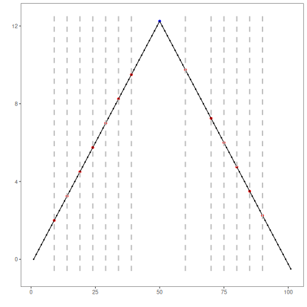
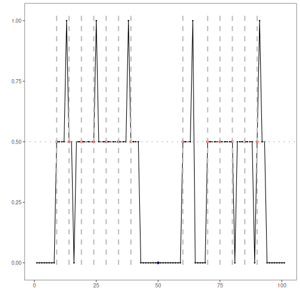

## Objective

Bayesian Online Change Point Detection (BOCPD) tracks change evidence
sequentially by updating a posterior distribution over run length. In this
notebook we:

- load and visualize a simple change-point dataset
- configure `hcp_bocpd()` with a Gaussian observation model
- inspect detected change points, evaluate them, and plot changepoint evidence

## Method at a glance

BOCPD: Bayesian Online Change Point Detection updates a posterior over the
current run length and converts that posterior into changepoint evidence. In
`hcp_bocpd()`, that evidence is summarized as a normalized score and thresholded
to produce final change-point candidates.

## What you will do

- understand the purpose of the example and when BOCPD is useful
- follow the workflow from data loading to model fitting and detection
- inspect the evaluation outputs and the diagnostic plots produced by Harbinger

### Prepare the Example

This setup anchors the notebook in the specific series used to examine
`hcp_bocpd()`. The raw signal is shown before any probabilistic modeling so the
later changepoint evidence can be interpreted against the visible regime
structure.


``` r
# Install Harbinger and ocp (if needed)
# install.packages("harbinger")
# install.packages("ocp")
```


``` r
# Load required packages
library(daltoolbox)
library(harbinger)
```


``` r
# Load example change-point datasets
data(examples_changepoints)
```


``` r
# Select the simple dataset
dataset <- examples_changepoints$simple
head(dataset)
```

```
##   serie event
## 1  0.00 FALSE
## 2  0.25 FALSE
## 3  0.50 FALSE
## 4  0.75 FALSE
## 5  1.00 FALSE
## 6  1.25 FALSE
```

### Interpret the Result Visually

This first visual pass establishes what the method should react to in the raw
series. Keep the method summary in mind here, because BOCPD is meant to assign
high evidence near regime transitions rather than to isolated local excursions.


``` r
# Plot the raw time series
har_plot(harbinger(), dataset$serie)
```


### Configure the Method

The configuration below turns the Bayesian monitoring idea into concrete
parameters. `hazard` controls the prior tendency to start a new regime, `dist`
defines the observation model used by `ocp`, and `threshold` maps normalized
changepoint evidence into final decisions.


``` r
# Configure BOCPD with a Gaussian observation model
model <- hcp_bocpd(
  hazard = 100,
  dist = "gaussian",
  threshold = 0.5
)
```

### Run the Core Analysis

This is the point where the notebook tests whether BOCPD assigns high
changepoint evidence to the actual structural break in the series. The package
relies on `ocp` for the posterior computation, so the example is skipped when
that optional dependency is unavailable.


``` r
if (requireNamespace("ocp", quietly = TRUE)) {
  # Fit the detector
  model <- fit(model, dataset$serie)

  # Run detection
  detection <- detect(model, dataset$serie)

  # Show detected change points
  print(detection |> dplyr::filter(event == TRUE))
} else {
  message("The 'ocp' package is not installed, so this example is skipped.")
}
```

```
##    idx event        type
## 1    9  TRUE changepoint
## 2   14  TRUE changepoint
## 3   19  TRUE changepoint
## 4   24  TRUE changepoint
## 5   29  TRUE changepoint
## 6   34  TRUE changepoint
## 7   39  TRUE changepoint
## 8   60  TRUE changepoint
## 9   70  TRUE changepoint
## 10  75  TRUE changepoint
## 11  80  TRUE changepoint
## 12  85  TRUE changepoint
## 13  90  TRUE changepoint
```

### Evaluate What Was Found

The evaluation asks whether the change-point candidates produced by
`hcp_bocpd()` match the labeled structure on this dataset. Read the scores as
evidence about the method's assumptions in practice, not as detached summary
numbers.


``` r
if (exists("detection")) {
  # Evaluate detections against labels
  evaluation <- evaluate(model, detection$event, dataset$event)
  print(evaluation$confMatrix)
}
```

```
##           event      
## detection TRUE  FALSE
## TRUE      0     13   
## FALSE     1     87
```

### Interpret the Result Visually

This visual check puts the model output back on top of the original signal.
What matters now is whether the highlighted change-point candidates and their
evidence align with the structure suggested by the raw series.


``` r
if (exists("detection")) {
  # Plot detections vs. ground truth
  har_plot(model, dataset$serie, detection, dataset$event)
}
```




``` r
if (exists("detection")) {
  # Plot normalized changepoint evidence and the decision threshold
  har_plot(model, attr(detection, "res"), detection, dataset$event, yline = model$threshold)
}
```



## References

- Adams, R. P., MacKay, D. J. C. (2007). Bayesian Online Changepoint Detection.
  arXiv:0710.3742
- Pagotto, A. (2019). `ocp`: Bayesian Online Changepoint Detection. R package.
