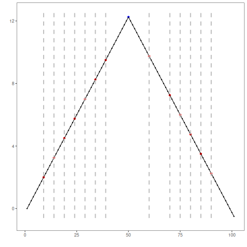

``` r
if (requireNamespace("ocp", quietly = TRUE)) {
  data(examples_changepoints)
  dataset <- examples_changepoints$simple

  model <- hcp_bocpd(hazard = 100, dist = "gaussian", threshold = 0.5)
  model <- fit(model, dataset$serie)
  detection <- detect(model, dataset$serie)

  print(detection[detection$event, ])
  har_plot(model, dataset$serie, detection, dataset$event)
} else {
  message("The 'ocp' package is not installed, so this example is skipped.")
}
```

```
##    idx event        type
## 9    9  TRUE changepoint
## 14  14  TRUE changepoint
## 19  19  TRUE changepoint
## 24  24  TRUE changepoint
## 29  29  TRUE changepoint
## 34  34  TRUE changepoint
## 39  39  TRUE changepoint
## 60  60  TRUE changepoint
## 70  70  TRUE changepoint
## 75  75  TRUE changepoint
## 80  80  TRUE changepoint
## 85  85  TRUE changepoint
## 90  90  TRUE changepoint
```


