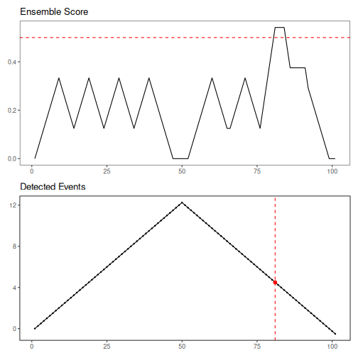

``` r
data(examples_changepoints)
dataset <- examples_changepoints$simple

model <- har_ensemble_fuzzy(hcp_amoc(), hcp_pelt(), hcp_cf_lr())
model <- fit(model, dataset$serie)
detection <- detect(model, dataset$serie, time_tolerance = 8, use_nms = TRUE)

print(detection[detection$event, ])
```

```
##    idx event type
## 81  81  TRUE
```

``` r
har_ensemble_plot(detection, dataset$serie)
```


