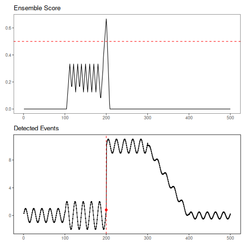
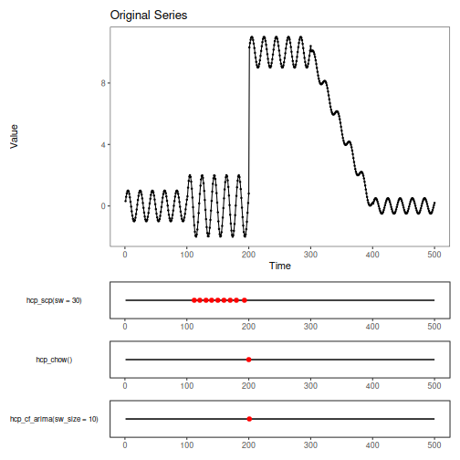

## Objective

This notebook focuses on the ensemble plotting functions. It uses the same
fuzzy ensemble configuration as the previous example so the plots stay aligned
with the shared `complex` benchmark used in this folder.

- load the same example change-point dataset used in the AMOC notebook
- fit the fuzzy ensemble
- inspect both the fused ensemble view and the per-model contribution view

## Method at a glance

`har_ensemble_plot()` summarizes the fused detection score, while
`har_ensemble_plot_models()` reveals how each base detector contributed to that
score around the candidate change region.


``` r
# Install Harbinger (if needed)
# install.packages("harbinger")
```


``` r
# Load required packages
library(daltoolbox)
library(harbinger)
```


``` r
# Load example change-point datasets
data(examples_changepoints)
```


``` r
# Select the same dataset used in the AMOC example
dataset <- examples_changepoints$complex
```


``` r
# Configure the same ensemble used in the previous notebook
model <- har_ensemble_fuzzy(
  hcp_scp(sw = 30),
  hcp_chow(),
  hcp_cf_arima(sw_size = 10)
)
```


``` r
# Fit the ensemble and run detection
model <- fit(model, dataset$serie)
detection <- detect(model, dataset$serie, time_tolerance = 8, use_nms = TRUE)
```


``` r
# Plot the fused ensemble score
har_ensemble_plot(detection, dataset$serie)
```




``` r
# Plot the contribution of each base detector
har_ensemble_plot_models(detection, dataset$serie)
```


