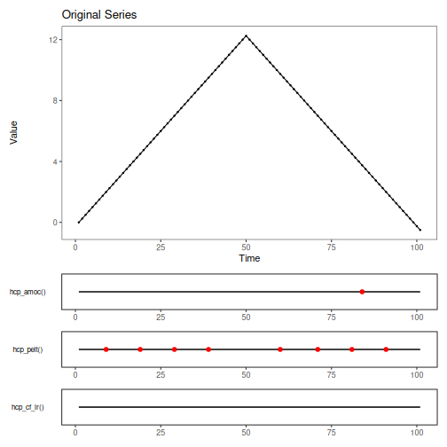

``` r
data(examples_changepoints)
dataset <- examples_changepoints$simple

model <- har_ensemble_fuzzy(hcp_amoc(), hcp_pelt(), hcp_cf_lr())
model <- fit(model, dataset$serie)
detection <- detect(model, dataset$serie, time_tolerance = 8, use_nms = TRUE)

har_ensemble_plot(detection, dataset$serie)
```


``` r
har_ensemble_plot_models(detection, dataset$serie)
```


