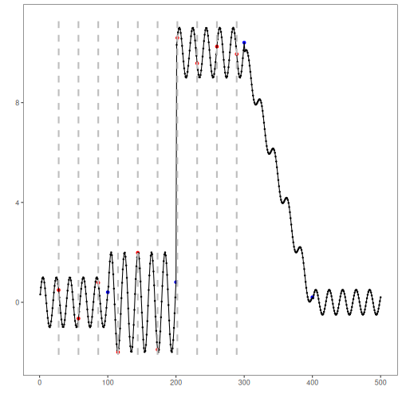

## Objective

This notebook demonstrates Page-Hinkley change-point detection on a univariate time series. The detector monitors the cumulative deviation from the running mean and flags a changepoint when the score becomes too large.

## Method at a glance

Page-Hinkley is a sequential test for persistent mean shifts. In Harbinger it is used as a univariate change-point detector for virtual drift in a single numeric series.

## Prepare the Example


``` r
data(examples_changepoints)
dataset <- examples_changepoints$complex
```

## Visualize the Raw Series


``` r
har_plot(harbinger(), dataset$serie)
```


## Configure the Method


``` r
model <- hcp_page_hinkley(min_instances = 30, delta = 0.005, threshold = 3, alpha = 0.999)
model <- fit(model, dataset$serie)
```

## Run Detection


``` r
detection <- detect(model, dataset$serie)
print(detection[detection$event, ])
```

```
##     idx event        type
## 28   28  TRUE changepoint
## 57   57  TRUE changepoint
## 86   86  TRUE changepoint
## 115 115  TRUE changepoint
## 144 144  TRUE changepoint
## 173 173  TRUE changepoint
## 202 202  TRUE changepoint
## 231 231  TRUE changepoint
## 260 260  TRUE changepoint
## 289 289  TRUE changepoint
```

## Evaluate the Result


``` r
evaluation <- evaluate(har_eval(), detection$event, dataset$event)
print(evaluation$confMatrix)
```

```
##           event      
## detection TRUE  FALSE
## TRUE      0     10   
## FALSE     4     486
```

## Plot the Detections


``` r
har_plot(model, dataset$serie, detection, dataset$event)
```



## References

- Page ES (1954). Continuous Inspection Schemes. Biometrika, 41(1/2), 100-115.
- Raab C, Heusinger M, Schleif FM (2020). Reactive Soft Prototype Computing for Concept Drift Streams. Neurocomputing.
