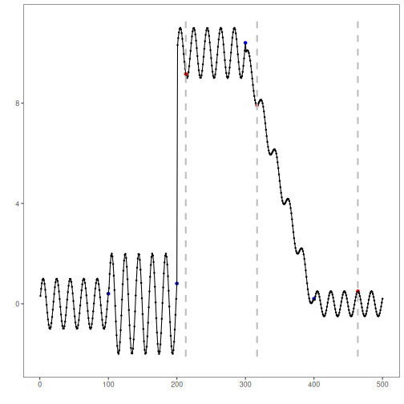

## Objective

This notebook demonstrates KSWIN change-point detection on a univariate time series. The detector compares an early sample with the most recent observations inside a sliding window and flags a changepoint when the two distributions differ significantly.

## Method at a glance

KSWIN is a window-based sequential detector for distributional change. In Harbinger it is restricted to one numeric series so that the output can be interpreted directly as virtual drift on the observed signal.

## Prepare the Example


``` r
data(examples_changepoints)
dataset <- examples_changepoints$complex
```

## Visualize the Raw Series


``` r
har_plot(harbinger(), dataset$serie)
```


## Configure the Method


``` r
model <- hcp_kswin(window_size = 100, stat_size = 30, alpha = 0.005)
model <- fit(model, dataset$serie)
```

## Run Detection


``` r
detection <- detect(model, dataset$serie)
print(detection[detection$event, ])
```

```
##     idx event        type
## 213 213  TRUE changepoint
## 317 317  TRUE changepoint
## 464 464  TRUE changepoint
```

## Evaluate the Result


``` r
evaluation <- evaluate(har_eval(), detection$event, dataset$event)
print(evaluation$confMatrix)
```

```
##           event      
## detection TRUE  FALSE
## TRUE      0     3    
## FALSE     4     493
```

## Plot the Detections


``` r
har_plot(model, dataset$serie, detection, dataset$event)
```



## References

- Raab C, Heusinger M, Schleif FM (2020). Reactive Soft Prototype Computing for Concept Drift Streams. Neurocomputing.
- Bifet A, Gavaldà R (2007). Learning from time-changing data with adaptive windowing. SIAM International Conference on Data Mining.
