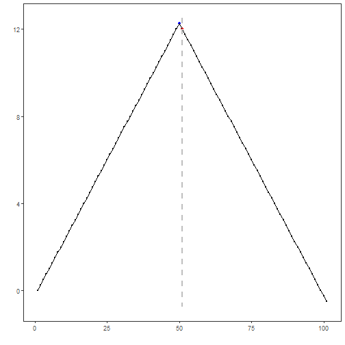

## Objective

This notebook demonstrates Joinpoint Regression++ for change-point detection on a univariate time series. The method fits connected linear segments and selects the number of breaks with information criteria, which makes it useful when the signal changes its trend in a structured way.

## Method at a glance

`hcp_joinpoint()` searches for a piecewise linear representation of the series. Harbinger evaluates models with `0` to `k_max` joinpoints, computes BIC, BIC3 and WBIC, and keeps the model with the smallest WBIC score.

In this notebook the method is described as Joinpoint Regression++ to distinguish it from the original permutation-test workflow in the reference literature. This implementation uses dynamic programming for global segment optimization, so it does not rely on brute-force breakpoint enumeration.

This is a good fit for series where the main evidence of change is a shift in slope or trend level rather than an isolated spike.

## Prepare the Example


``` r
source(url("https://raw.githubusercontent.com/cefet-rj-dal/harbinger/main/examples/seed.R"))
```

```
## Warning in readLines(file, warn = FALSE): cannot open URL
## 'https://raw.githubusercontent.com/cefet-rj-dal/harbinger/main/examples/seed.R': HTTP status was '404 Not Found'
```

```
## Error in `readLines()`:
## ! cannot open the connection to 'https://raw.githubusercontent.com/cefet-rj-dal/harbinger/main/examples/seed.R'
```

``` r
data(examples_changepoints)
dataset <- examples_changepoints$complex
```

## Visualize the Raw Series


``` r
har_plot(harbinger(), dataset$serie)
```


## Configure the Method


``` r
model <- hcp_joinpoint(
  min_between = 20,
  min_end = 20,
  k_max = 1,
  log_transform = FALSE
)

set_example_seed()
```

```
## Error in `set_example_seed()`:
## ! could not find function "set_example_seed"
```

``` r
model <- fit(model, dataset$serie)
model$model$comparison
```

```
##   k       RSS       BIC     BIC3    Weight      WBIC
## 1 0 9010.6987 2.9164182 2.916418 0.0000000 2.9164182
## 2 1  911.8359 0.6505688 0.662998 0.8837996 0.6615537
```

## Run Detection


``` r
detection <- detect(model, dataset$serie)
print(detection[detection$event, ])
```

```
##     idx event        type
## 201 201  TRUE changepoint
```

## Evaluate the Result


``` r
evaluation <- evaluate(har_eval(), detection$event, dataset$event)
print(evaluation$confMatrix)
```

```
##           event      
## detection TRUE  FALSE
## TRUE      0     1    
## FALSE     4     495
```

## Plot the Detections


``` r
har_plot(model, dataset$serie, detection, dataset$event)
```



## References

- Kim HJ, Fay MP, Feuer EJ, Midthune DN (2000). Permutation Tests for Joinpoint Regression with Applications to Cancer Rates. Statistics in Medicine, 19(3), 335-351.
- Kim HJ, Chen HS, Midthune D, Wheeler B, Buckman DW, Green D, Byrne J, Luo J, Feuer EJ (2023). Data-driven choice of a model selection method in joinpoint regression. Journal of Applied Statistics, 50(9), 1992-2013.
- National Cancer Institute. Joinpoint Trend Analysis Software. https://surveillance.cancer.gov/joinpoint/
